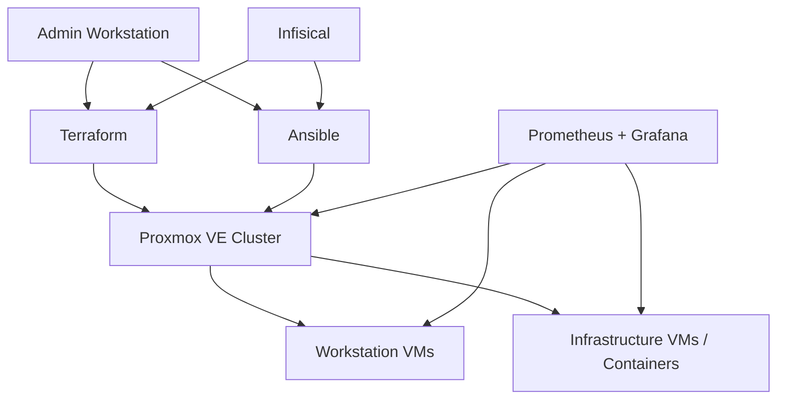

# Homelab Infrastructure as Code

Infrastructure-as-Code repository used to build, configure and operate my
Proxmox-based homelab.

The project is primarily a learning and experimentation environment for
DevOps, infrastructure automation and systems administration.

It uses **Terraform** for infrastructure provisioning and **Ansible** for
host and guest configuration, with **Infisical** providing secrets at runtime.

The approved reconstruction direction adds **K3s** for suitable workloads,
**Flux** as the initial GitOps candidate and **TrueNAS** centralized application
storage. These are target requirements, not deployed capabilities. Rebuild useful
functionality and preserve technical data; do not clone every historical guest.
The proposed path is three disposable server VMs on pve-lab, then separately
qualified distributed hosts and eventual mini-PC placement. A single-host lab
is not physical HA. Review the canonical architecture before implementation.

Start with the [documentation index](docs/README.md), [architecture](docs/architecture.md)
and [roadmap](docs/roadmap.md). Read [AGENTS.md](AGENTS.md) and the assigned
[task](tasks/README.md) before implementation. Follow the
[documentation maintenance contract](tasks/README.md#contrat-de-maintenance).
For loss of the controller or control plane, start with the
[recovery contract and minimum kit specification](docs/recovery-contract.md).
It records prerequisites and missing evidence, not a completed recovery process.
The [Recovery Kit preparation](docs/recovery-kit-preparation.md) provides the
capture plan and synthetic structural checks (`make recovery-check`); no kit
has been exported or recovered. The [headless controller profile](docs/headless-controller.md)
is validated in CI but has not been deployed; it is now an optional test adapter
for portable Mac/Linux recovery, not a required bootstrap dependency.

## Goals

- Treat infrastructure configuration as code
- Make VM deployments reproducible
- Minimize manual configuration
- Separate infrastructure provisioning from OS configuration
- Keep credentials and secrets outside of Git
- Build reusable automation instead of one-off scripts
- Experiment with production-style DevOps workflows in a homelab environment

## Tech Stack

- **Proxmox VE** — virtualization platform
- **Terraform** — VM and infrastructure provisioning
- **Ansible** — host and guest configuration
- **Infisical** — secrets management
- **Prometheus** — metrics collection
- **Grafana** — monitoring and visualization
- **Docker Compose** — service deployment where appropriate
- **Git / Forgejo** — source control and CI/CD experimentation
- **Make** — repeatable local workflows

## Architecture

The following diagram describes the existing operator workflow, not the new
Kubernetes target. The single authoritative target and service reconstruction
matrix are in [architecture](docs/architecture.md); implementation order is in
[roadmap](docs/roadmap.md). No Kubernetes installation or service migration has
been performed by the redesign.



## Terraform

Terraform manages infrastructure resources such as:

- Proxmox virtual machines
- CPU and memory allocation
- Virtual disks
- Network interfaces
- VM tags
- References to PCI/USB mappings owned by Ansible

Current workstation roots adopt existing VM hardware; they do not reconstruct
installed operating systems (clone sources are currently null). Base-image
creation and complete recovery remain separate work.

Infrastructure-specific secrets are injected at runtime through Infisical
rather than stored in Terraform configuration.

Operator workflow (plan queries live infrastructure; apply changes it and
requires explicit approval of the reviewed plan):

```bash
make workstations-plan
make workstations-apply
make workstations-verify
```

## Ansible

Ansible handles configuration that belongs to the operating system or
Proxmox host rather than to the VM resource itself.

Examples include:

- VFIO configuration
- GPU binding
- PCI and USB resource mappings
- Proxmox ACL configuration
- CPU affinity
- Proxmox hook scripts
- Monitoring deployment
- Node Exporter deployment
- Host auditing

The roles aim for idempotence; syntax checks alone do not prove repeatable
convergence on a fresh host. Consult the relevant qualification/runbook first.

## Shared Workstation Pool

One of the more experimental parts of this project is a pool of workstation
VMs sharing physical workstation hardware.

The VMs can represent different environments such as:

- Windows gaming
- Windows development
- Windows school/work
- Ubuntu development
- Fedora development

They share resources such as a dedicated GPU and USB peripherals through
PCI/USB passthrough.

Because the physical hardware cannot safely be assigned to multiple guests at
the same time, an Ansible-managed Proxmox hook provides exclusive access.

```text
Start workstation B
        │
        ▼
Discover VMs tagged "workstation"
        │
        ▼
Is another workstation running?
        │
       yes
        │
        ▼
Request graceful shutdown
        │
        ▼
Wait until stopped
        │
        ▼
Release shared hardware
        │
        ▼
Start workstation B
```

There is deliberately no automatic forced shutdown: if a guest cannot shut
down cleanly, the new workstation is not started.

Workstation membership is discovered dynamically through Proxmox tags rather
than a hardcoded list of VM IDs.

## Repository Structure

```text
.
├── ansible/
│   ├── inventories/
│   ├── playbooks/
│   └── roles/
│
├── terraform/
│   ├── examples/
│   └── stacks/
│       ├── deb13-monitoring/
│       ├── pve-lab-workstations/
│       ├── pve-compute-forgejo-runner/           # historical
│       ├── pve-compute-forgejo-runner-migration/ # active CT301
│       ├── pve-core-garage/
│       ├── pve-core-tfstate/
│       └── pve-lab-controller/                 # undeployed, optional test host
│
├── services/
│   ├── monitoring/
│   └── ci-images/
│
├── docs/                  # architecture, roadmap, runbooks, dated audits
├── tasks/                 # bounded work and acceptance evidence
├── scripts/
├── tests/
├── .forgejo/workflows/
├── AGENTS.md
├── keys/
├── Makefile
└── ansible.cfg
```

### `terraform/stacks/pve-lab-workstations`

Manages workstation VMs and their shared hardware configuration.

### `terraform/stacks/deb13-monitoring`

Provisions infrastructure used by the monitoring stack.

### `ansible/roles/pve_workstation_host`

Configures the Proxmox host for workstation workloads, including VFIO,
resource mappings, CPU affinity and workstation arbitration.

### `services/monitoring`

Contains the Prometheus/Grafana monitoring configuration.

## Guest Configuration

Guest configuration is discovered from Proxmox VM tags. A guest must have the
`guest` tag, and capability tags such as `workstation`, `dev`, `gaming`, or
`nvidia` determine which roles are selected. The `guest_base` role always runs;
capabilities do not imply one another.

The dynamic inventory reads Proxmox API credentials from runtime environment
variables: `PROXMOX_URL`, `PROXMOX_USER`, `PROXMOX_TOKEN_ID`, and
`PROXMOX_TOKEN_SECRET`. Guest SSH settings are supplied through
`GUEST_LINUX_USER`, `GUEST_WINDOWS_USER`, and optionally
`GUEST_SSH_PRIVATE_KEY_FILE`. These values must come from Infisical or another
secure runtime injection mechanism, never from Git.

Windows guests currently use OpenSSH with PowerShell as the shell. This keeps
the Linux and Windows connection model consistent with the repository's
existing SSH-based controller conventions. A live prerequisite remains: each
Windows guest must have OpenSSH Server, PowerShell remoting over SSH, and the
chosen key-based account configured before Ansible can connect.

Workflows (only guests-check is offline; inventory queries Proxmox and
guests-apply performs live changes requiring approval):

```bash
make guests-check
make guests-inventory
make guests-apply LIMIT=dev
make guests-apply LIMIT=w11-game
```

`guests-check` validates the playbook without contacting guests.
`guests-inventory` queries Proxmox and shows discovered groups. `guests-apply`
requires an explicit `LIMIT`; it does not run against every guest by default.

The NVIDIA tag currently records declarative intent only. Guest driver
installation is deferred until the supported Linux repositories, Windows
driver source, and passthrough validation procedure are confirmed.

## Controller Prerequisites

Use Git, Make, Terraform matching the controlled workflow version, and Python
compatible with requirements-controller.txt (Ansible 14 requires Python >=3.12).
`make setup-controller CONTROLLER_PYTHON=/path/to/python3` recreates disposable
`.venv` from the Python and collection dependency files. CI pins its own Python;
local setup otherwise uses system python3. Downloads require network access.
Live workflows additionally need authorized SSH/API trust and runtime credentials;
see the relevant runbook rather than copying private inputs into Git.

## Forgejo Validation

CI currently performs state-independent validation only. Production Terraform
state is operator-local; plan/apply CI is blocked pending the reviewed
[state migration and CI/CD safety gates](tasks/080-control-plane-and-cd.md).

The repository includes a validation-only Forgejo Actions workflow at
`.forgejo/workflows/validate.yml`. It targets main only and is gated by
`CI_QUALITY_APPROVED`; run139 passed on CT301/Linux AMD64 at `01ccefb`.
Outstanding runner trust findings still block formal security closure.
Label `homelab-iac` selects the existing image for controller setup, eight-root
backend-disabled validation, Ansible/Compose checks, tests and secret scanning.
See [CI quality boundaries and local validation](docs/ci-quality.md).

The workflow does not request Proxmox or Infisical credentials or invoke plans,
apply, destroy or convergence. That does not make the shared runner safe for
untrusted code: CT301 uses one daemon and three connections with a global socket
allowlist. No pull-request job is authorized on that runner.
The manual `publish-ci-base.yml` workflow handles later image releases;
first publication uses a one-time controller-driven SSH procedure. The workflow
requires package-write Actions secrets and explicit socket access. See [`docs/forgejo-runner.md`](docs/forgejo-runner.md) for
the intended runner separation and one-time bootstrap checks.

## Secrets

Never commit credentials to this public repository.

Runtime secrets are provided through **Infisical**.

Files containing local configuration, Terraform state and environment-specific
values are excluded from Git.

Example configuration files are provided where appropriate:

```text
terraform.tfvars.example
.infisical.example.json
```

The tracked `.infisical.json` contains only non-secret project-link metadata.
Machine Identity credentials, access tokens, and exported secrets remain
runtime-only.

## Current Status

This repository is actively evolving as I expand the homelab and learn more
about infrastructure automation.

| Capability | Evidence level and limits |
| --- | --- |
| Selected Proxmox resources, guest/host roles and monitoring | Implemented; dated deployment evidence in the [documentation index](docs/README.md), not complete homelab reconstruction |
| Quality CI | LIVE VERIFIED in run139; [runner trust preflight](tasks/010-runner-trust-preflight.md) remains separate and unresolved |
| Terraform state | Six stack states remain local; no migration; single-writer local model recommended initially; future shared backend decided by requirements, not mandatory PG/Consul deployment |
| Independent recovery | [Contract accepted](docs/recovery-contract.md); [preparation/tests](docs/recovery-kit-preparation.md) implemented; private payloads, custody qualification and recovery tests pending |
| K3s / Flux / TrueNAS integration | Target only; no deployed cluster, no production data migration; first implementation after approval is [Task100](tasks/100-stage-a-headless-vms.md) |
| Reusable headless module / protected CD | Planned; existing workstation state protected; see [roadmap](docs/roadmap.md) for distinct gates |

Task files own current progress. Dated audits remain historical evidence and
must not be rewritten to imply later implementation or live verification.

## Why This Repository Exists

My background is primarily in software development, but building this homelab
led me deeper into infrastructure, Linux, networking and DevOps.

Rather than configuring systems manually, I use the lab to practice building
infrastructure that is reproducible, version-controlled and automated.

The goal is not simply to self-host services, but to understand the tooling
and engineering practices used to operate infrastructure reliably.
