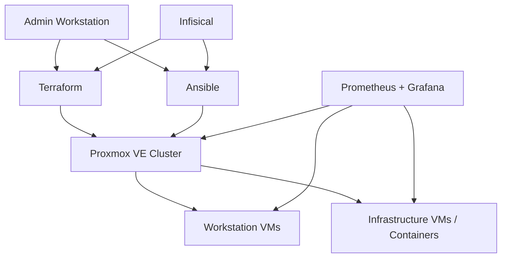

# Homelab Infrastructure as Code

Infrastructure-as-Code repository used to build, configure and operate my
Proxmox-based homelab.

The project is primarily a learning and experimentation environment for
DevOps, infrastructure automation and systems administration.

It uses **Terraform** for infrastructure provisioning and **Ansible** for
host and guest configuration, with **Infisical** providing secrets at runtime.

## Goals

- Treat infrastructure configuration as code
- Make VM deployments reproducible
- Minimize manual configuration
- Separate infrastructure provisioning from OS configuration
- Keep credentials and secrets outside of Git
- Build reusable automation instead of one-off scripts
- Experiment with production-style DevOps workflows in a homelab environment

## Tech Stack

- **Proxmox VE** — virtualization platform
- **Terraform** — VM and infrastructure provisioning
- **Ansible** — host and guest configuration
- **Infisical** — secrets management
- **Prometheus** — metrics collection
- **Grafana** — monitoring and visualization
- **Docker Compose** — service deployment where appropriate
- **Git / Forgejo** — source control and CI/CD experimentation
- **Make** — repeatable local workflows

## Architecture



## Terraform

Terraform manages infrastructure resources such as:

- Proxmox virtual machines
- CPU and memory allocation
- Virtual disks
- Network interfaces
- VM tags
- PCI resource mappings
- USB resource mappings
- VM cloning from base templates

Infrastructure-specific secrets are injected at runtime through Infisical
rather than stored in Terraform configuration.

Example workflow:

```bash
make workstations-plan
make workstations-apply
make workstations-verify
```

## Ansible

Ansible handles configuration that belongs to the operating system or
Proxmox host rather than to the VM resource itself.

Examples include:

- VFIO configuration
- GPU binding
- PCI and USB resource mappings
- Proxmox ACL configuration
- CPU affinity
- Proxmox hook scripts
- Monitoring deployment
- Node Exporter deployment
- Host auditing

The roles are designed to be idempotent, allowing the same playbooks to be
rerun without unnecessarily changing already-correct infrastructure.

## Shared Workstation Pool

One of the more experimental parts of this project is a pool of workstation
VMs sharing physical workstation hardware.

The VMs can represent different environments such as:

- Windows gaming
- Windows development
- Windows school/work
- Ubuntu development
- Fedora development

They share resources such as a dedicated GPU and USB peripherals through
PCI/USB passthrough.

Because the physical hardware cannot safely be assigned to multiple guests at
the same time, an Ansible-managed Proxmox hook provides exclusive access.

```text
Start workstation B
        │
        ▼
Discover VMs tagged "workstation"
        │
        ▼
Is another workstation running?
        │
       yes
        │
        ▼
Request graceful shutdown
        │
        ▼
Wait until stopped
        │
        ▼
Release shared hardware
        │
        ▼
Start workstation B
```

There is deliberately no automatic forced shutdown: if a guest cannot shut
down cleanly, the new workstation is not started.

Workstation membership is discovered dynamically through Proxmox tags rather
than a hardcoded list of VM IDs.

## Repository Structure

```text
.
├── ansible/
│   ├── inventories/
│   ├── playbooks/
│   └── roles/
│
├── terraform/
│   ├── examples/
│   └── stacks/
│       ├── deb13-monitoring/
│       └── pve-lab-workstations/
│
├── services/
│   └── monitoring/
│
├── keys/
├── Makefile
└── ansible.cfg
```

### `terraform/stacks/pve-lab-workstations`

Manages workstation VMs and their shared hardware configuration.

### `terraform/stacks/deb13-monitoring`

Provisions infrastructure used by the monitoring stack.

### `ansible/roles/pve_workstation_host`

Configures the Proxmox host for workstation workloads, including VFIO,
resource mappings, CPU affinity and workstation arbitration.

### `services/monitoring`

Contains the Prometheus/Grafana monitoring configuration.

## Guest Configuration

Guest configuration is discovered from Proxmox VM tags. A guest must have the
`guest` tag, and capability tags such as `workstation`, `dev`, `gaming`, or
`nvidia` determine which roles are selected. The `guest_base` role always runs;
capabilities do not imply one another.

The dynamic inventory reads Proxmox API credentials from runtime environment
variables: `PROXMOX_URL`, `PROXMOX_USER`, `PROXMOX_TOKEN_ID`, and
`PROXMOX_TOKEN_SECRET`. Guest SSH settings are supplied through
`GUEST_LINUX_USER`, `GUEST_WINDOWS_USER`, and optionally
`GUEST_SSH_PRIVATE_KEY_FILE`. These values must come from Infisical or another
secure runtime injection mechanism, never from Git.

Windows guests currently use OpenSSH with PowerShell as the shell. This keeps
the Linux and Windows connection model consistent with the repository's
existing SSH-based controller conventions. A live prerequisite remains: each
Windows guest must have OpenSSH Server, PowerShell remoting over SSH, and the
chosen key-based account configured before Ansible can connect.

Safe local workflows are:

```bash
make guests-check
make guests-inventory
make guests-apply LIMIT=dev
make guests-apply LIMIT=w11-game
```

`guests-check` validates the playbook without contacting guests.
`guests-inventory` queries Proxmox and shows discovered groups. `guests-apply`
requires an explicit `LIMIT`; it does not run against every guest by default.

The NVIDIA tag currently records declarative intent only. Guest driver
installation is deferred until the supported Linux repositories, Windows
driver source, and passthrough validation procedure are confirmed.

## Secrets

No credentials are committed to this repository.

Runtime secrets are provided through **Infisical**.

Files containing local configuration, Terraform state and environment-specific
values are excluded from Git.

Example configuration files are provided where appropriate:

```text
terraform.tfvars.example
.infisical.example.json
```

## Current Status

This repository is actively evolving as I expand the homelab and learn more
about infrastructure automation.

Current areas include:

- [x] Terraform-managed Proxmox VMs
- [x] Ansible-managed Proxmox configuration
- [x] Shared GPU/USB workstation pool
- [x] Automatic workstation discovery using Proxmox tags
- [x] Prometheus / Grafana monitoring
- [x] Runtime secret injection
- [x] Reusable Make workflows
- [ ] Automated guest configuration
- [ ] Automated base-image creation
- [ ] CI/CD validation and deployment
- [ ] Container orchestration experimentation

## Why This Repository Exists

My background is primarily in software development, but building this homelab
led me deeper into infrastructure, Linux, networking and DevOps.

Rather than configuring systems manually, I use the lab to practice building
infrastructure that is reproducible, version-controlled and automated.

The goal is not simply to self-host services, but to understand the tooling
and engineering practices used to operate infrastructure reliably.
