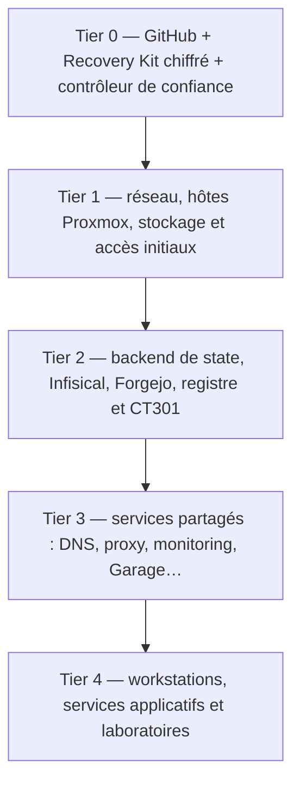

# Architecture de `homelab-iac`

> **Contrat du projet :** reproduire une infrastructure Proxmox compatible sur du matériel remplaçable, réconcilier un cluster déjà géré et reconstruire le *control plane* depuis un contrôleur indépendant. Les services et leur configuration technique sont dans le périmètre; les données personnelles et les sauvegardes générales des utilisateurs ne le sont pas.

Ce document décrit **l'architecture visée** et distingue explicitement les éléments existants des évolutions proposées. L'audit du 24 septembre 2026 décrit la situation observée au commit `fd4435e`; il ne certifie pas les évolutions ultérieures. Pour la preuve historique, consulter [l'état courant audité](audits/2026-09-24/current-state.md), [les dépendances](audits/2026-09-24/dependency-and-bootstrap.md), [la modularité](audits/2026-09-24/modularity-and-portability.md) et [les states et la récupération](audits/2026-09-24/state-and-recovery.md).

## 1. Décisions et frontières

- **Self-hosted en exploitation :** Proxmox pour les ressources, Terraform pour le provisionnement, Ansible pour la configuration, Forgejo et ses runners pour la CI/CD, Infisical pour les secrets courants. Le backend de state sera choisi entre PostgreSQL et Consul après qualification; Garage n'est pas un backend Terraform autorisé.
- **Dépendance externe minimale :** GitHub fournit une copie récupérable du code *après vérification de sa fraîcheur*; un cloud externe transporte les générations chiffrées du Recovery Kit. Ce cloud n'est jamais un backend actif.
- **Périmètre de réutilisation :** composants portables entre environnements Proxmox compatibles; pas de promesse de fonctionnement universel sur tous les hyperviseurs ni de migration automatique de GPU/USB.
- **Monorepo d'abord :** extraire un module interne lorsqu'une deuxième utilisation et ses tests le justifient. Ne pas créer un framework, un ordonnanceur ou plusieurs dépôts avant d'avoir des interfaces éprouvées.
- **État technique des services :** configuration, comptes techniques, politiques, clefs et identité sont déclarés ou identifiés comme éléments à restaurer. L'IaC ne reconstitue pas les données mutables qu'il ne possède pas.
- **Séparation de propriété :** une ressource réelle n'a qu'un propriétaire IaC. Terraform gère l'objet Proxmox; Ansible gère l'OS et le service; Compose gère les processus monitoring prévus. Documenter toute exception, notamment l'affinité et les hooks des workstations.

## 2. Situation vérifiée au dernier audit

| Domaine | État au 2026-09-24 | Limite à ne pas masquer |
| --- | --- | --- |
| Terraform | Sept roots dont six stacks; **zéro module enfant**; six states locaux | Aucun state de stack n'est distant; les copies adjacentes ne constituent pas une récupération hors contrôleur. |
| Ansible | Neuf rôles, treize playbooks | Les rôles ne sont pas tous génériques ni démontrés idempotents sur un hôte vierge. |
| CI | Deux workflows, dont validation sans credentials de production | La validation ne couvre que trois roots; tests backup et scan Gitleaks absents du workflow actuel. |
| Runner | CT301 active et service observé; registre et identité requis pour les jobs | Le socket Podman rootful est une frontière de privilège; reconstruction complète non démontrée. |
| PostgreSQL | CT300, opérations et locking qualifiés via SSH; backup logique restauré | Écoute loopback, certificat définitif, identités, sortie réseau CI et récupération complète en attente. |
| Consul | Non déployé | Pas de backend sélectionné. |
| Services fondamentaux | Plusieurs endpoints observés actifs | Infisical, Forgejo, AdGuard, Caddy, hôtes et stockage ne sont pas entièrement décrits/restaurables par ce dépôt. |
| Portabilité | Roots spécifiques à `doku-lab`; matériels passthrough explicités | Aucun second profil déployé; l'adoption des VM workstations ne reconstruit pas leurs disques OS. |

**Cas particulier :** l'ancien root du runner possède un state historique associé à l'ancien CT300, maintenant réutilisé par PostgreSQL. Ne jamais confondre ces deux états, supprimer le state ancien ou importer des ressources pour « nettoyer » sans contrat de propriété approuvé.

## 3. Couches d'architecture

Ce diagramme exprime les **niveaux de responsabilité**, pas un ordre de démarrage universel. Le graphe réel place par exemple le DNS/PKI, TrueNAS et le registre en amont de certaines étapes du control plane; voir [l'audit des dépendances](audits/2026-09-24/dependency-and-bootstrap.md). Un chemin de secours adressé directement doit rester possible lorsque le DNS normal est indisponible.

### Tier 0 — indépendant du homelab

Contrôleur remplaçable, version du dépôt externe vérifiée, states de bootstrap récupérables, inputs privés nécessaires, accès de secours et clés de déchiffrement. Le Recovery Kit comporte des **copies scellées et datées**, jamais une deuxième copie active du state. Clé de déchiffrement utilisable via le trousseau iCloud, avec une voie indépendante hors ligne et récupération du compte cloud prévue.

### Tier 1 — fondations physiques

Un hôte Proxmox, son réseau, ses bridges, son stockage et les templates ou artefacts nécessaires doivent exister avant le déploiement des invités. Ces prérequis physiques ont aujourd'hui des procédures principalement manuelles : ne pas les présenter comme Terraform-managed.

### Tier 2 — control plane

Le bootstrap doit être lançable depuis le Tier 0. Il restaure ou configure progressivement les dépendances indispensables : DNS/trust minimaux, secret recovery d'Infisical, backend de state, Forgejo/registre et runner. L'ordre précis vient du graphe audité et du matériau de récupération disponible; le runner et Infisical ne sont pas des prérequis du *premier* Terraform bootstrap.

### Tiers 3 et 4 — services et workloads

Chaque service doit fournir son contrat de reproductibilité : provisions, configuration déclarative, identité technique, éventuel état applicatif à restaurer et validation d'une seconde convergence. Les workloads matériels (gaming/GPU/USB) doivent disposer d'un profil hôte et de prérequis explicites.

## 4. Contrat des composants réutilisables

| Couche | Responsabilité | Ne doit pas contenir |
| --- | --- | --- |
| Module Terraform | Créer un objet de ressource; entrées claires et outputs utiles | IP, node, storage et identité propre à un seul homelab codés en dur |
| Rôle Ansible | Installer et configurer une capacité/service | Hypothèses non déclarées sur l'inventaire ou orchestration d'un autre service |
| Blueprint/composition | Associer des modules et rôles avec prérequis, vérifications et limites | Moteur d'exécution maison ou état Terraform concurrent |
| Environnement | Sélectionner placement, ressources, réseau, domaines, secrets *par référence* | Credentials en clair et duplication de logique commune |
| Workflow | Ordonner bootstrap, reconcile ou recover en réutilisant les mêmes composants | Import/destroy/adoption automatiques fondés seulement sur la découverte |

Le terme « blueprint » est un **contrat documentaire et une composition**, pas un nouveau format obligatoire. Les interfaces initiales doivent être minimales et vérifiées par deux profils avant extraction externe.

### Abstraction du matériel

Le prérequis 035 ajoute un petit root Linux headless à state local séparé,
sans tag/hook workstation ni passthrough. Le root workstation conserve ses
adresses et propriétés, avec GPU/USB désormais optionnels et anciens defaults
préservés. Aucun déplacement d'état ou déploiement live : voir
[procédure et limites](headless-controller.md).

Séparer **besoin logique** et **capacité de l'environnement** : hôte compatible, storage ID, datastore de template, bridge/VLAN pris en charge, capacité CPU/RAM, adresse attribuée, accès SSH. Les mappings PCI/USB, IOMMU et CPU pinning restent des profils physiques spécifiques, avec contrôle explicite avant l'apply. Une machine de remplacement peut exiger une adaptation approuvée, pas une réécriture des rôles génériques.

## 5. Trois modes, un même code

| Mode | Point de départ | Garde essentielle |
| --- | --- | --- |
| **Bootstrap** | Contrôleur indépendant et fondations joignables | Autorisation et state de bootstrap récupérés sans backend distant ni runner |
| **Reconcile** | Services de contrôle et state faisant autorité disponibles | Plan revu, locks du backend, idempotence, opérations non destructives par défaut |
| **Recover** | État partiellement perdu ou divergent | Geler les writers, identifier la génération faisant autorité, restaurer/importer seulement après revue |

Un futur `doctor` pourra **observer** versions, trust, connectivité et présence des states. Il ne décidera pas seul d'adopter, de détruire ou de déplacer des ressources.

## 6. Autorité des states et reprise

Le [contrat Recovery Kit v1](recovery-contract.md) précise désormais l'autorité
par root, le manifeste privé minimal et l'ordre de reprise indépendant.
Contrat accepté par l'opérateur le 2026-09-25, pas un kit produit ou un restore
vérifié. GitHub doku-code/homelab-iac et iCloud Drive (ciphertext uniquement)
sont les destinations approuvées; staging hors sync, garde offline indépendante
et inventaire ciblé sont détaillés dans la [préparation 040](recovery-kit-preparation.md).
Le validateur synthétique ne prouve ni exhaustivité ni récupération. Les petits
matériaux bootstrap et les références vers des payloads indépendants doivent
tous être récupérables; une référence à un PBS perdu n'est pas une sauvegarde
indépendante. 040 qualifie récupération/déchiffrement et contrôleur statique;
050 fournit l'interface de secours, avant un drill live séparément autorisé.

Les six roots de stack sont locaux à la date de l'audit. Les roots nécessaires à la reconstruction du backend ou des fondations ne devront pas dépendre de ce même backend. La migration vers PostgreSQL ou Consul est ultérieure, root par root, avec vérification lineage/serial, sauvegarde scellée, absence de destination déjà active et preuve de locking.

Le Recovery Kit v1 vise uniquement les matériaux d'infrastructure indispensables à une reprise indépendante; il ne duplique pas les données personnelles. Les bases/identités techniques d'Infisical et Forgejo, le trust DNS/PKI et les prérequis PBS/TrueNAS restent à inventorier et à tester. La restauration d'un invité et la reproduction de sa configuration ne sont pas équivalentes.

## 7. Sécurité et exécution CI

**CI de qualité d'abord :** tests hors ligne, sans credentials de production, sans state réel, sans `apply` et uniquement dans une frontière runner explicitement approuvée. L'exécution de code non fiable sur le runner partagé est interdite tant que la frontière Podman rootful et l'accès réseau ne sont pas isolés et vérifiés.

**CD ensuite :** branche et revue protégées, identités minimales, state distant sélectionné et restaurable, plan exact approuvé, autorisation distincte d'apply, vérifications Ansible et de service. Le CI ne doit jamais utiliser un checkout vide comme source d'autorité pour des ressources existantes.

## 8. Sources de vérité et changement

Maintenir ce document lorsqu'une architecture réelle ou une décision approuvée
change, conformément au [contrat de maintenance](../tasks/README.md#contrat-de-maintenance).
Une conception approuvée reste cible tant que son implémentation et sa validation
ne sont pas établies; les preuves détaillées résident dans la tâche ou le runbook.

1. **État réel + state faisant autorité** : preuve d'exploitation, à lire uniquement via des opérations autorisées.
2. **Code du dépôt** : comportement implémenté au commit examiné.
3. **Ce document** : architecture et décisions projetées, révisées lorsque validées.
4. **[Roadmap](roadmap.md) et [`tasks/`](../tasks/README.md)** : priorités et travail approuvé.
5. **[Audit 2026-09-24](audits/2026-09-24/executive-summary.md)** : instantané historique, pas un statut live permanent.

Tout changement de propriétaire IaC, de backend, de root, de state, d'identité ou d'environnement critique nécessite une tâche séparée, des tests et une autorisation explicite. Aucun refactoring « esthétique » ne doit modifier des adresses de ressources ou la politique de cycle de vie sans plan vérifié.
