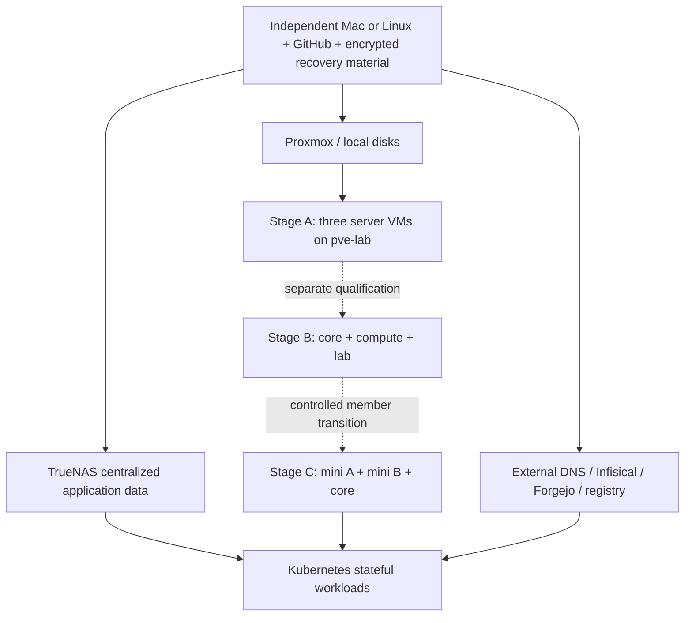

# Canonical Reconstruction Architecture

Reconstruct desired functionality and irreplaceable technical state, not the
old arrangement of guests and workarounds. This is the single current design.
[Roadmap](roadmap.md) owns sequencing; [tasks](../tasks/README.md) own acceptance.
Nothing here authorizes implementation, allocation, deployment or migration.

## Decisions and evidence

| Classification | Direction |
| --- | --- |
| APPROVED OPERATOR REQUIREMENTS | Proxmox virtualization; K3s preferred for suitable workloads; Flux initial GitOps candidate; Terraform infrastructure, Ansible OS/cluster bootstrap, GitOps Kubernetes applications, Infisical runtime secrets; TrueNAS centralized application storage |
| APPROVED OPERATOR REQUIREMENTS | A: three separate server VMs with embedded etcd on pve-lab, NOT physical HA. B: one server VM each on core/compute/lab. C: mini-PC A, mini-PC B, core; initially 8 GB per mini-PC, upgrade to 16 GB |
| APPROVED OPERATOR REQUIREMENTS | Local system/etcd disks; no Longhorn/Ceph; accept TrueNAS-dependent application outage. Preserve workstations. GitHub code, iCloud ciphertext, independent offline decryption; no synced active state |
| TECHNICAL RECOMMENDATIONS | Single operator/local Terraform authority initially; 3 x 2-vCPU/3-GiB Stage A; modest baseline networking, explicit ingress ownership; foundational DNS/Infisical/Forgejo outside Kubernetes initially; workload-specific DB/storage |
| UNRESOLVED DECISIONS | Recommendation acceptance, live allocations/capacity, API endpoint/VIP, CIDRs, mini-PC hypervisor choice, TrueNAS version/CSI compatibility, independent service backups, custody, ingress/TLS, service DB choices and eventual shared backend |
| IMPLEMENTED AND VERIFIED | Only existing code and dated evidence below. No K3s, Flux, CSI or target-service migration implemented or qualified |

### Actual baseline

Repository at c636d1f: eight Terraform roots, zero child modules, six local
state files; controller/example have no state. Fourteen Ansible playbooks,
nine roles, monitoring Compose and CI image source. No Kubernetes app definitions.
State presence/structure rechecked without printing attributes or private inputs.

| Evidence | Known result | Limit |
| --- | --- | --- |
| Audit fd4435e, 2026-09-24 | Four Proxmox hosts; CT301 runner, CT300 PG candidate, CT209 Garage, VM207 Infisical, VM208 monitoring, DNS/proxy guests; Forgejo endpoint on TrueNAS | Historical, not complete current service/recovery proof |
| Code and previous qualifications | CT/runner/PG/Garage automation; PG disposable locking/crash/isolation/logical restore; Garage native Terraform locking rejected | No production backend or full host recovery qualified |
| Live quality CI | Operator-reported run139/01ccefb; directly observed run24/8c12871 and run25/c636d1f success; eight roots in latest workflow | Not deployment, recovery or runner isolation; Tasks010/020 security criteria unchanged |
| Earlier Task035 preflight, 2026-09-25 | pve-lab 32 threads/~30 GiB usable RAM, ~27.5 GiB available; workstations already stopped; local import/lab-vms capacity | Not concurrent peak capacity or permission to stop a workstation |
| Recovery preparation | GitHub independently matched c636d1f; synthetic manifest checks; PBS metadata and OCI digests inspected | No produced/decrypted kit, independently restored technical payloads or completed DR |
| Operator statements in this request | TrueNAS dedicated application SSD and 10 GbE uplink; mini-PC 8-to-16 GB intent | No measured latency/endurance, client bandwidth or future hardware deployment |

Task035 preflight remains intact: VMID603/.32 are unapproved proposals, DHCP
exclusion unknown; no plan/apply/start/convergence. It becomes an optional test
host for portable recovery, not a mandatory first guest. No new live inspection
was needed in this architecture review. Nextcloud/Plex/torrent actual layouts
and versions remain UNKNOWN. See immutable [audit](audits/2026-09-24/current-state.md)
and [recovery inventory](recovery-kit-preparation.md).

## Topology and sizing

| Stage | Proposal / budget | Failure domain and approval |
| --- | --- | --- |
| Current | infra: DNS/proxy; core: critical infrastructure; compute: runner/bots; lab: workstation pool; TrueNAS/PBS services | Existing ownership unchanged; full physical backup independence unknown |
| A development | Three distinct headless Debian VMs, each 2 vCPU, 3 GiB RAM, 32 GiB local SSD-backed system/etcd disk; workloads on servers initially | Same physical host/power/storage. 9 GiB cluster + 16 GiB workstation + ~3 GiB host = ~28 GiB: narrow margin on ~30 GiB usable. No guaranteed concurrent 4-GiB recovery VM |
| B distributed | One server VM per core/compute/lab, using measured A sizing | Verify critical core and bot-heavy compute headroom. Two survivors must support quorum AND required workloads; separate live approval |
| C permanent | Prefer Proxmox + one VM per mini if measurements fit: 8 GB physical, reserve ~2 GB host overhead, 3-4 GiB VM, remaining safety margin; at 16 GB consider 6-8 GiB VM after measurement | Bare metal gives more RAM/fewer layers but loses uniform VM lifecycle/isolation/console and needs separate host install/recovery ownership. Decision before purchase/deployment, no 32-GB requirement |

Budgets are proposals, not allocations or performance guarantees. Before A apply,
measure ordinary running workstation + host use; retain at least 2 GiB headroom.
Do not stop/shrink workstations to pass. If 3 GiB/node is insufficient, negotiate
capacity or placement first. Proposed scaling triggers: sustained host headroom
below 2 GiB, OOM, node MemoryPressure/DiskPressure, etcd fsync warnings or service
latency beyond its agreed budget => stop adding workloads and measure. Establish
24-hour representative workload baseline and one-node-loss capacity before B.
Review storage below 20% free or inadequate restore/snapshot space. These are
not configured alerts or approved RPO/RTO/SLOs.

Upstream minimums do not include our application fleet. Three embedded-etcd
servers tolerate one member failure, not their shared host's failure.
[K3s requirements](https://docs.k3s.io/installation/requirements),
[etcd quorum](https://docs.k3s.io/datastore/ha-embedded).

## Ownership and interfaces

| Sole writer | Responsibility | Explicit boundary |
| --- | --- | --- |
| Terraform | Proxmox VM/disk/NIC lifecycle in per-environment roots | No app manifests, guest packages or etcd membership surgery; existing addresses/states unchanged |
| Ansible | OS/users/trust/time, pinned K3s config/binaries, controlled joins/upgrades/removals; initial Flux bootstrap | Hand off app objects to Flux; never continuously manage the same Helm release or app resource |
| Flux | Reviewed Kubernetes platform/application manifests and Helm releases from protected ref | No Proxmox state/credentials; one bootstrap root and explicit management hand-off |
| Infisical | Runtime secrets/scoped identities | Select one Kubernetes secret-sync mechanism after review; its own DB/keys/first access recover outside itself |
| TrueNAS administration | Pools/datasets/shares/quotas/encryption and storage guardrails | Later CSI owns delegated child volumes only, not objects simultaneously managed by Terraform/Ansible |
| Make/operator | Narrow operator commands and approval sequencing | No new orchestration framework or automatic adoption |

Adapt the tested headless primitive into a small reusable component for new
controller/cluster use. Task100 must not move workstation addresses. Environment
maps select node/identity/storage/network/sizing without copying a whole stack.
Use separate state for each environment. A node-variable change is NOT safe
etcd migration: it may replace the VM. Join/remove one member at a time with
quorum, fencing and snapshot checks, or explicitly rebuild a disposable cluster.
Never clone live etcd disks or start two copies of one member identity.

## Networking, ingress and trust

Recommend existing bridges initially only after approved IPs and pod/service
CIDR overlap checks against LAN/VPN/future sites. Flannel/CoreDNS/network-policy
baseline first, not a new CNI project. Private API; management sources restricted,
etcd only between servers, required CNI/node ports scoped to peers. Deny workload
access to management networks with tested policies and host/network controls;
namespaces alone are not isolation. No public API, etcd or DB endpoint.

A can use a documented server API address with a tested manual alternate. B
requires a stable independently reachable registration/API endpoint, TLS SANs
and failover test. VIP/LB mechanism remains a task110 decision, not an allocation.
Keep AdGuard and existing edge Caddy outside the cluster initially. The first
app uses port-forward/internal test access, not production DNS/ingress changes.

Recommend one pinned Flux-owned Traefik release when ingress is needed, after
disabling bundled Traefik on all servers. Explicitly decide ServiceLB ports and
ownership; avoid competing ingress writers/listeners. Caddy remains an edge
where justified, not a mandatory extra hop for every app. Review renewal,
certificate ownership and public routes separately. K3s includes ingress/LB
defaults: [networking services](https://docs.k3s.io/networking/networking-services).

Emergency access uses console/SSH and a protected address/fingerprint/CA map,
not disabled host/TLS verification. Public DNS/time/downloads or verified cache
must work without AdGuard. Reissue leaf certificates only after proving external
DNS/CA/account recovery; preserving every old leaf certificate is unnecessary.

## Storage and databases

TrueNAS is an accepted single data-availability dependency. Its uplink does not
prove end-to-end latency, fsync safety or independent backups. K3s system disks
and etcd remain on local host storage. No Longhorn/Ceph in this target.

| Workload | Recommendation | Hard gate |
| --- | --- | --- |
| NFS-compatible/shared files | TrueNAS datasets, explicit UID/GID/ACL, quotas/export clients | Multi-client permissions, disconnect/reconnect and restore; retain production data on claim deletion |
| SQLite | Single writer on filesystem over dedicated block volume, or native TrueNAS app; supported server DB alternative where useful | No shared NFS SQLite/WAL; prove old-writer fencing before remount on another node. RWO is not complete fencing proof |
| PostgreSQL/other client-server DB | Per-app DB native on TrueNAS where simplest; K8s DB only after qualified block storage/backup | Roles/version/transaction consistency and isolated restore; no automatic DB-on-NFS recommendation |
| Kubernetes block storage | Qualify maintained, installed-version-compatible TrueNAS CSI/iSCSI; static disposable volume first if compatibility unclear | Single attachment, stale attachment recovery, power loss, expansion, reclaim and backup. No production default StorageClass yet |
| Monitoring data | Bounded retention/resources; outside observer remains | Decide expendable metrics vs retained Grafana identity/config; cluster loss must remain observable |

[SQLite WAL](https://www.sqlite.org/wal.html) excludes network filesystems.
[TrueNAS CSI guidance](https://www.truenas.com/docs/solutions/integrations/csidriver/csidriver/)
covers NFS/block choices; installed version and compatibility remain unknown here.
No driver or storage credentials are provisioned. ZFS redundancy/snapshots are
not independent backups. DB and file/blob snapshots need a consistent boundary.

## Service reconstruction matrix

All placements are RECOMMENDATIONS, not migration authorization. The following
two tables together form each service's twelve-part reconstruction contract.
Current locations are dated evidence; versions/layouts not inspected stay unknown.
Every stateful migration requires a service-specific compatibility, recovery,
cutover and rollback task before any production writer changes.

| Service / desired functionality | Bootstrap role; proposed placement/declaration | Secrets, identity and irreplaceable data; storage/DB |
| --- | --- | --- |
| AdGuard: LAN DNS/filtering | Normal bootstrap aid, emergency bypass required. REBUILD OUTSIDE KUBERNETES; Ansible config/service, Terraform guest after ownership review | Admin access, rewrites/filter policy/exceptions; local config; query history retention optional |
| Caddy: TLS edge/routes/remote access | Normal control-plane routes, not sole recovery path. REBUILD OUTSIDE KUBERNETES; Ansible routes, simplify redundant proxies | DNS/tunnel credentials, account/CA material where irreplaceable, route policy; leaf certs reissuable with authority |
| Infisical: scoped runtime secrets | Normal operations, never own recovery prerequisite. REBUILD OUTSIDE KUBERNETES initially; pinned supported deployment/dedicated DB | Consistent DB + matching encryption keys; projects/policies/identities/secret versions; independent backup |
| Forgejo: Git/permissions/Actions/OCI | Not first recovery dependency. KEEP ON TRUENAS initially; declarative supported app/config rather than ad hoc runtime copy | DB/repos/app keys/Actions secrets/users/ACLs/registrations/package metadata+blobs; actual datasets unknown |
| Runner and OCI: trusted execution/artifacts | Not needed for first cluster. REBUILD OUTSIDE KUBERNETES runner; existing Ansible role; digest-pinned artifacts | Matching registrations/tokens and pull access; independently preserve OCI blobs/manifests or qualify external rebuild; no host workload secrets |
| Vaultwarden: vaults/accounts | Not sole break-glass store. DEFER UNTIL DEPENDENCIES QUALIFIED, then REBUILD IN KUBERNETES if storage safe | DB, attachments/sends, identities/encryption-related state; safe single-writer block or supported server DB, never replace vault with empty DB |
| Homepage: service navigation | No bootstrap requirement. REBUILD IN KUBERNETES after disposable demo; versioned config/manifests | Scoped widget secrets; config/customizations; normally no DB |
| Wiki.js: knowledge/documents | Not recovery source of record. REBUILD IN KUBERNETES after synthetic DB restore | DB/accounts/content/uploads/auth identities; dedicated logical DB + file dataset |
| Nextcloud: files/shares/collaboration | No bootstrap requirement. KEEP ON TRUENAS initially; supported app configuration | Consistent DB/config/user-files, instance identity/salts/keys, ACLs and app compatibility; actual layout unknown |
| Plex: media/transcoding | No bootstrap requirement. KEEP ON TRUENAS if hardware fits, otherwise dedicated media host | Library DB/metadata/account identity; media separate; GPU access/capacity to verify |
| qBittorrent/Gluetun: VPN-confined transfers | No bootstrap requirement. KEEP ON TRUENAS initially as scoped app/Compose workload | VPN credentials, session/resume/config and download files/permissions; confinement mandatory |
| Garage: internal object API if demanded | No bootstrap role. RETIRE IF NO LONGER REQUIRED, otherwise dedicated service pending consumer contract | Objects + metadata/layout/RPC identity; never Terraform state backend under rejected qualification |
| Monitoring: metrics/alerts/diagnostics | Outside observer supports recovery. ADAPT external observer + GitOps cluster collectors | Grafana identities/config, alerts/silences and selected history; bounded storage, no blind volume copy |
| Databases / CT300 tfstate | Per-service logical isolation; KEEP outside initially where simpler, conditional K8s DB later | Roles/grants/data/backup keys; CT300 remains candidate, zero production state; not Infisical DB or K3s etcd |
| D2 bots/workstations/compute | KEEP ON DEDICATED COMPUTE/HARDWARE; Terraform guest shape, Ansible capabilities | OS/license/auth/session/app/user state; CPU/GPU/USB/latency constraints; not automatic Kubernetes candidates |
| Print/peripherals | KEEP ON DEDICATED COMPUTE/HARDWARE until device contract established | Device/queue/config/access; no blanket retirement of unmodeled guests |

| Service | DNS/access; backup/restore and health acceptance | Cutover/rollback; discardable implementation |
| --- | --- | --- |
| AdGuard | LAN DNS; encrypted config recovery; forward/reverse/filter and internal-DNS-loss tests | Parallel resolver then reviewed client change, restore prior config; CT200/path incidental |
| Caddy | Approved edge routes only; protected config/accounts; TLS renewal + direct emergency tests | Test hostname then route switch/rollback; manual edits and needless proxy layers disposable |
| Infisical | Restricted TLS/admin access; DB+key restore; allowed/denied identity-scope tests | Freeze writes, restore isolated, switch/fence old writer; old VM shape/path incidental |
| Forgejo | HTTPS/SSH/Git/registry; coherent DB/repos/blobs backup; clone/push/ACL/package-pull tests | Freeze pushes/jobs/packages for final sync; one writer; rollback must include new writes/schema compatibility, not stale DB; current app mechanism changeable |
| Runner/OCI | Polling/scoped registry; encrypted identity and artifact catalogue; harmless job/pull/isolation tests | Stop original before matching identity starts; exactly one registration writer; legacy labels/CT300/caches not requirements |
| Vaultwarden | TLS/restricted admin; protected full data set; synthetic login/sync/attachment restore | Maintenance/final sync, one writer; rollback reconciles new vault writes; CT206/runtime incidental |
| Homepage | Internal HTTPS; config + secret recovery; widget/least-privilege tests | Parallel URL, route switch/config rollback; CT201 incidental |
| Wiki.js | TLS/auth; DB+files backup; edit/search/upload/restore tests | Read-only old source, final sync, one writer; schema-compatible reverse path; CT202/path incidental |
| Nextcloud | TLS/WebDAV/trusted proxies; DB/config/files consistent backup; file hashes/shares/permissions/jobs tests | Maintenance/final sync; retain immutable recovery point, reconcile writes before rollback; current version/runtime not automatically fixed |
| Plex | Restricted access; DB/config backup + independent media policy; playback/transcode/library tests | Isolated metadata test then one writer; prior version only with compatible DB; container details incidental |
| Torrent/VPN | Private UI, VPN-only egress; config/session backup; kill-switch/leak/restart tests | Pause transfer, coherent session handover, one instance; wrapper replaceable, confinement not |
| Garage | Private endpoints; object+metadata restore/API tests if kept | Inventory consumers before retirement; protect bytes/keys until accepted; CT209/backend experiment not reason to keep it |
| Monitoring | Internal UI/constrained scrape+alert egress; config/selected data backup; scrape/alert/cluster-loss tests | Parallel collection then deduplicated alert switch; old observer retained until acceptance; Compose topology not sacred |
| Databases | Private native TLS, no HTTP proxy; engine-native backup/isolated restore, role/transaction/lock tests | Fence old writer, require schema rollback compatibility; shared DB server/candidate sunk cost not a requirement |
| D2/compute/workstations | Restricted management; OS/app recovery sets; actual workload/peripheral acceptance | Own approved window, never stopped by cluster tasks; VM numbering incidental but current state identity protected |
| Print/peripherals | LAN-only access; queue/device recovery and real print test | Retain original until qualified replacement; Kubernetes rewrite not presumed beneficial |

First workload: public pinned stateless demo, zero production data/credentials.
Prefer maintained upstream charts when they meet a service contract; verify
support/version then, not an invented universal chart migration.

## Availability and recovery

| Failure | Automatic behavior / accepted outage | Manual recovery and required proof |
| --- | --- | --- |
| One server VM | Two members retain quorum; stateless replicas can reschedule only with capacity/placement | Test API/endpoint and rescheduling; local data/block fencing may prevent automatic recovery |
| One physical host | A loses all cluster nodes; B/C can retain quorum with one server lost | Approved member rebuild and fencing; surviving workload/storage/network capacity separately proven |
| TrueNAS unavailable | Dependent apps/DBs unavailable by accepted design; local etcd/API may remain | Restore storage and consistency before app writes; no forced duplicate DB writer; Forgejo on NAS also affected |
| DB outage/corruption | App outage; restarting a pod is not data repair | Freeze, isolated compatible restore, verify roles/data, approve promotion; RPO/RTO measured later |
| Forgejo/registry down | Existing workloads may run; reconcile/new pulls/builds may fail | External source and artifacts; explicit reviewed source recovery, no automatic untrusted upstream failover |
| Infisical down | Cached/materialized secrets may survive; expiry/new startup/rotation may fail | External DB+key recovery, narrow independent bootstrap access; no guaranteed availability from cache |
| Complete K3s loss | No automatic recovery claimed | Independent controller: reconstruct nodes; snapshot+matching token OR fresh GitOps rebuild plus service restores, with identity requirements decided |
| Controller/whole homelab lost | Complete recovery NOT VERIFIED | Independent Mac/Linux, source, ciphertext, offline decryption and console access; restore foundations before dependent services |

Recommend native reproducible tools on Mac ARM64/Linux AMD64, optional disposable
VM adapter. A Forgejo-only recovery container image would recreate the bootstrap
cycle, so it cannot be mandatory. Reuse pins/requirements and small Make interfaces,
not a new recovery OS or orchestration product.

Order: independent machine/code/decryption -> physical console/network/time/trust
-> Proxmox/local storage and TrueNAS/PBS prerequisites -> DNS/PKI and external
Infisical/Forgejo recovery as required -> authoritative states/cluster bootstrap
or restore -> Flux from reviewed external code -> app DB/files -> verify and
explicitly return one writer to operation. Disposable K3s can use public artifacts
and isolated test tokens without production secrets or a full production kit.

Separate: small encrypted kit (authority map/private inputs/break-glass/trust/
key custody/technical-backup receipts); service backup sets; bulk personal/media
backups; public rebuild code/artifacts. Required independent bytes must actually
exist, not only a PBS pointer. A preserved K3s snapshot also needs its matching
server token; protect both as sensitive material, outside failed cluster custody.
[K3s backup/restore](https://docs.k3s.io/datastore/backup-restore).
The archive's sole decryption method must remain outside that archive.

[Recovery contract](recovery-contract.md) authority/custody rules remain valid.
Adapt the hardcoded six-root verifier before capturing new states; its structural
PASS does not prove complete catalogue or Git bundle validity. Synthetic tooling
first; real export/decryption/drill separately approved. No plaintext synced
staging, no production kit on test VMs by default.

## Backend and ownership transitions

Recommend local state and one designated operator writer initially, with protected
independent captures. It does not coordinate separate controllers/copies; no CI
applies or automatic stale fallback. [Terraform local locking](https://developer.hashicorp.com/terraform/language/backend/local).
Before multi-writer/protected infrastructure CD, Task080 evaluates requirements.
External PostgreSQL is a leading conditional option due to existing evidence,
not sunk cost: verify-full/identities/network/full recovery remain gaps. Consul
adds another quorum service without established need; defer unless a concrete
requirement justifies it. Garage remains rejected. Never host bootstrap state
inside the cluster it must recover. No backend selection/migration occurs here.

Ownership transition: privately inventory address/lineage, freeze all writers,
verify recovery set, review mapping/import/state move only if necessary, approve
no-unexpected-replacement plan, transfer once and fence previous writer. No root
refactor combined with backend migration. New nodes use new state without adopting
old guests. App transitions use isolated target/coherent restore/single-writer
cutover; keep old resource and rollback point until acceptance. Never blindly
destroy existing resources or run duplicate DB/runner identities.

## Existing work disposition

| Workstream | Classification | Reason / successor |
| --- | --- | --- |
| Existing roots and local authorities | KEEP | Real ownership protected; no cleanup of addresses/states in planning |
| Headless VM primitive | ADAPT | Tested base for three new nodes; Task100, no workstation moves |
| Dedicated controller035 | ADAPT, optional/deferred | Portable050 primary; proposed VM603/.32 remains unapproved |
| Controller deps/guest Ansible | KEEP / ADAPT | Reuse tools/OS ownership, add K3s lifecycle; no workstation host role on cluster nodes |
| Mandatory LXC-first090 | RETIRE as roadmap prerequisite | No demonstrated second LXC use case; active CT code stays |
| Recovery contract030 | KEEP | Independent custody and single authority still required |
| Kit040 tooling | ADAPT | Separate portable synthetic checks from production completeness, evolve inventory deliberately |
| Independent controller050 | ADAPT | Mac/Linux first; full kit and VM not prerequisite for synthetic implementation |
| Mandatory PG/Consul060/070 sequence | REPLACE | Requirements-led080; no forced Consul deployment |
| Forgejo quality CI | KEEP | Working checks; expand only for new code, never grant deployment privileges |
| Shared runner trust | ADAPT | 010 unresolved; no production cluster-admin or state credentials on shared quality path |
| Infisical authority | KEEP / ADAPT | Preserve runtime authority; explicit bootstrap and Kubernetes sync scope |
| Monitoring Compose | ADAPT | Keep external observation; cluster collectors by need; exporter/Compose coupling deferred |
| Existing services | UNDECIDED per service until qualification | Preserve required function/data, not every legacy deployment |
| Garage backend direction | RETIRE | Failed locking; object service continuation needs a real consumer |

## Operator decisions before implementation

Approve recommendations and first code-only Task100. Review actual A capacity/
allocations before plan; pinned K3s/API/CIDRs before bootstrap; storage/fencing
before stateful tests; payload/custody before migrations; B/C capacity/member
transition before live relocation; backend and runner security before privileged CD.

Flux reads reviewed code; generic bootstrap writes manifests to Git and needs
an explicit ownership/credential hand-off, not silent invocation.
[Flux installation](https://fluxcd.io/flux/installation/).
Quality CI must never receive production kubeconfig, state or Infisical credentials.
