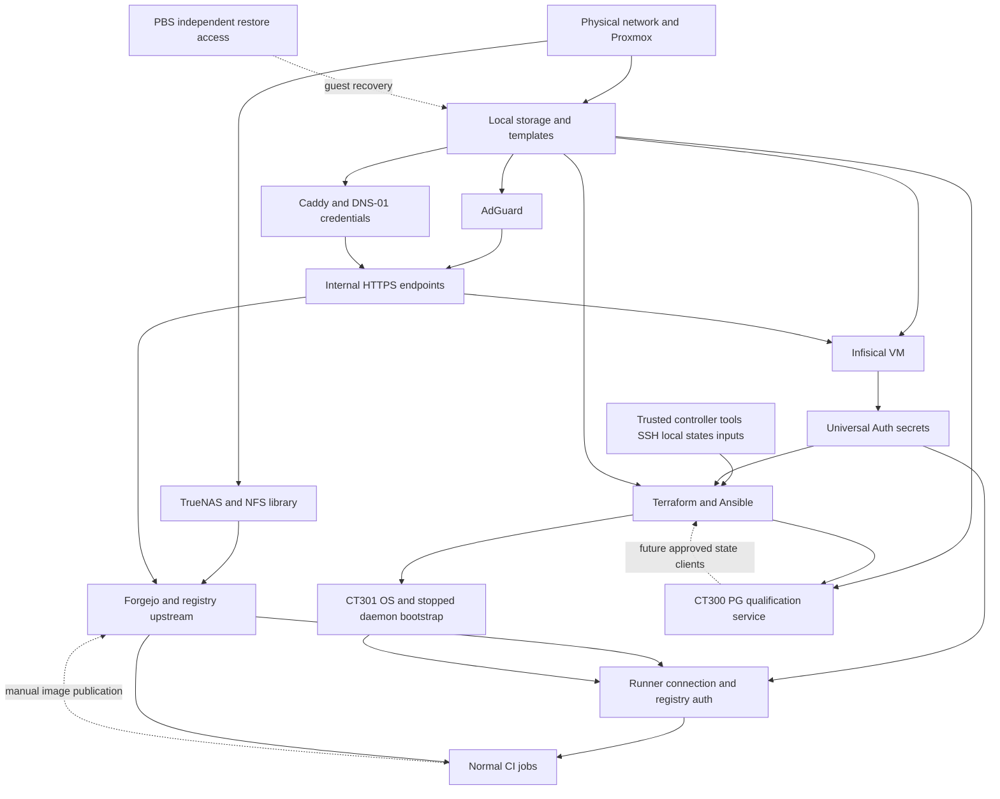
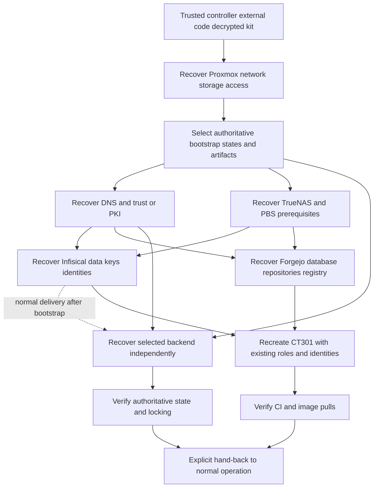

# Dependencies and bootstrap

Evidence labels are defined in [current-state](current-state.md).

## Actual operational dependencies

Solid arrows mean prerequisites of the normal path. Dashed arrows are recovery,
purpose-limited or explicitly future dependencies, not deployed backend use.

**VERIFIED IN SOURCE CODE:** Makefile:15-27 wraps Terraform in Universal Auth;
project metadata comes from `.infisical.json`. Runner configuration also needs
Infisical. Provider runtime auth can technically be supplied independently,
but a tested control-plane-free operator bootstrap interface is MISSING.

**VERIFIED ON LIVE INFRASTRUCTURE:** Caddy fronts Forgejo and Infisical.
Forgejo's proxy target is on the TrueNAS endpoint; internal app/database storage
layout UNKNOWN. Fresh installs require external package/artifact sources.
A running service's cached image does not prove clean reconstruction.

## Cycles, escape paths and unknowns

| Dependency | Evidence and conclusion |
| --- | --- |
| Infisical -> Terraform -> infrastructure for Infisical | Source proves normal coupling. Recovery cycles if wrapper is the only path; Infisical itself has no root here. Need independently recoverable authorization, not a second everyday secret store. |
| Runner -> publisher -> registry image -> runner job | Source proves first-image dependency. Empty stopped-daemon bootstrap needs neither job image nor another runner. Controller publication instructions are an escape path, not a tested complete disaster runbook. |
| Runner configuration -> Infisical recovery | Would cycle if restore were runner-only; no such restore implementation exists. Use independent controller. |
| Backend root -> itself | NOT present: all stack states local, CT300 explicitly local. Moving backend/foundation roots into that backend would introduce recovery coupling. |
| PostgreSQL renewal -> Infisical -> PostgreSQL | PROPOSED ONLY: renewal absent; Infisical uses a separate DB, not CT300. No current shared-database cycle. Retain working certificates through temporary delivery outages. |
| DNS/PKI -> DNS/PKI recovery | Normal endpoints depend on these services. Early recovery needs independently trusted address-based access; full flow MISSING. |
| Backups -> infrastructure needing restore | PBS external to CT300 verified; physical storage/network/credential independence UNKNOWN. |
| Proxmox/storage -> Terraform -> Proxmox/storage | First hypervisor/network/storage is manual prerequisite, not created by current guest roots. |

## Minimum independent start

**PROPOSED ONLY:** trusted computer, external code at known commit, verified
toolchain/download access, decrypted Recovery Kit, Proxmox authorization/trust,
reachable network, host storage/bridge and template or PBS restore material.
Recover authoritative state before reconciling survivors. Forgejo, runner,
Infisical and remote backend are not intrinsic Terraform/Ansible requirements,
but the repository does not demonstrate this independent path yet.

Mandatory: authorization, trust, state, network, storage. Convenience: existing
runner/CI orchestration. DNS/PKI is required for normal HTTPS, not necessarily
the first address-based recovery step. Internet is needed for fresh downloads
unless artifacts are independently cached/verified. PBS is essential when it
contains the only required mutable state, not for every empty disposable CT.

## Proposed recovery order

Proposal, not executable instructions. Final backend/Infisical ordering depends
on TLS and independent credential delivery. Do not keep the only backend recovery
authorization inside an unavailable service. Reuse components across modes.

## Capability and failure cases

**VERIFIED IN SOURCE CODE:** tool setup and CT roles exist. **MISSING:** independent
state/private-input recovery manifest and complete foundation restore.
**REPORTED BY PREVIOUS QUALIFICATION:** clean CT301 deployment and disposable PG
logical recovery; neither demonstrates total-control-plane reconstruction.

| Case | Current capability and prerequisites |
| --- | --- |
| A: healthy cluster | Operator flows given local state, SSH, inputs, Infisical, downloads. CI validation exists, production CD does not. |
| B: managed guest lost | CT models reproduce host shape; restore application identity/data. Workstation roots do not rebuild OS. Review replacement explicitly. |
| C: different replacement node | Manual hypervisor/storage/bridge, reviewed PCI/USB/CPU mappings/capacities. No replacement qualification. |
| D: CT301 lost | Controller can provision/bootstrap and retrieve existing connection/registry auth; images required for jobs. No other runner needed. Full recovery drill missing. |
| E: backend lost | No production state in PG today. Future recovery needs writer freeze, independent host state, backups/roles/trust, locking proof. |
| F: Infisical or Forgejo down | Infisical blocks wrapper/runner configuration; Forgejo blocks checkout/jobs/images. Existing services may continue. Independent recovery partly manual. |
| G: Mac lost | Local states, inputs, SSH/trust and secret bootstrap not proven recoverable elsewhere. Clone alone insufficient. |
| H: control plane down | No complete recovery proof. Recover physical access/storage/PBS and encrypted technical state first. |
| I: new compatible Proxmox | Models help; node/storage/templates/bridge/allocation/auth environment-specific. No second-profile deploy test. |

No recovery actions executed. Drills require separately approved allocations,
network isolation, rollback and maintenance boundaries.
