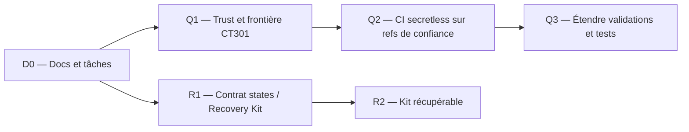

# Roadmap de `homelab-iac`

> **Priorité d'exécution :** rendre la CI **qualité** utile le plus tôt possible, protéger l'autorité des states en parallèle, puis qualifier un backend self-hosted et reconstruire le control plane avant d'autoriser le déploiement automatisé de production.

Ce document réordonne à dessein les milestones de [l'audit](audits/2026-09-24/milestone-roadmap.md) : le pipeline de validation sans secrets peut démarrer avant le Recovery Kit et le choix du backend **si** la frontière de sécurité du runner est vérifiée. La CD qui écrit en production attendra les preuves de récupération et les autorisations nécessaires. Toutes les dates/statuts correspondent au dernier audit, pas à une observation permanente.

## Décisions fixes

- Exploitation self-hosted; GitHub est une copie externe du code, le cloud conserve seulement des générations chiffrées du Recovery Kit.
- Terraform + Ansible + Proxmox + Forgejo/CT301 + Infisical; monorepo incrémental. Pas de migration générale, de SaaS backend, de refactoring massif ni de « détection intelligente » destructrice.
- PostgreSQL et Consul sont **candidats**. Garage est explicitement rejeté comme backend Terraform. Aucun state existant n'a été migré au 2026-09-24.
- Contrats de récupération et preuves d'état prévalent sur la présentation ou le nombre de modules.

## Chemin court vers la première CI utile

Q1 est un **gate de sécurité** : un runner doté d'un socket Podman rootful ne doit pas exécuter de PR non fiables avant isolation. Q2 n'a pas besoin d'Infisical, des credentials Proxmox ou des states de production. En l'absence de frontière jugée sûre, faire tourner les validations depuis le contrôleur en attendant un runner correctement isolé; ne pas désactiver les contrôles.

## Vue des milestones

| ID | Milestone | Dépendance immédiate | Statut au départ | Acceptation essentielle |
| --- | --- | --- | --- | --- |
| D0 | Documentation et contrat de travail agent | Audit reçu | À intégrer | Architecture, roadmap, tasks et AGENTS fusionné cohérents |
| Q1 | Vérifier la sécurité et la santé du runner | D0 | À faire | Frontière trust/Podman et provenance des workflows établies |
| Q2 | CI qualité minimal sans secrets | Q1 | Partiellement présent | Chaque changement de référence autorisée exécute des checks hors ligne sans privilège de production |
| Q3 | Couverture CI et corrections ciblées | Q2 | À faire | Six stacks, 13 playbooks, tests runner/backup, secret scan et diagnostics fiables |
| R1 | Autorité des states et contrat Recovery Kit | D0 | À faire | Six roots classés, ancien runner isolé, GitHub vérifié, génération/key recovery définies |
| R2 | Recovery Kit chiffré et restauré | R1, autorisation | À faire | Récupération sur autre contrôleur, sans deuxième state écrivain |
| B1 | Contrôleur bootstrap indépendant | R1–R2 | À faire | Outils/trust/inputs vérifiés sans Forgejo, Infisical ou backend disponible |
| F1 | Inventaire de récupération des fondations | R1, B1, accès | À faire | Prérequis Proxmox/TrueNAS/PBS/Infisical/Forgejo/DNS explicités |
| P1 | PostgreSQL candidat production | R2, B1, autorisations | En cours | TLS verify-full, identities, réseau, locks finaux, recovery testés |
| C1 | Consul candidat isolé | R2, B1, allocation | À faire | Tests équivalents de TLS/ACL, lock, panne, isolation et restore |
| S1 | Choix du backend et contrat de migration | P1, C1, F1 | À faire | Choix explicite et chemin de récupération indépendant |
| DR1 | Reconstitution isolée du control plane/CT301 | R2, B1, F1, S1 | À faire | Nouveau contrôleur -> runner fonctionnel sans dépendance au runner original |
| T1 | Canary de state non-bootstrap | S1, DR1, autorisation | À faire | Un seul state faisant autorité, aucune recréation inattendue |
| CD1 | CI/CD à privilèges protégés | Q3, T1, DR1 | À faire | Plan approuvé, exact, identité minimale, apply opt-in, fail closed |
| M1 | Premier module LXC réutilisable | Q3, R1 | À faire | Deux profils, extraction address-safe, no-op reconcile |
| M2 | Deuxième environnement jetable | M1, R2/B1 | À faire | Autre profil node/storage/network sans modification interne du module |
| A1 | Adoption des services existants | DR1, propriétaire établi | Progressif | Service par service, contrat d'état et récupération vérifiés |
| H1 | Essai de remplacement matériel | M2, DR1, capacité | À faire | Déploiement sur hôte compatible différent, limites observées |

Les IDs ci-dessus désignent ce document, **pas** les M1–M15 historiques de l'audit. Les tâches opérationnelles sont dans [`tasks/`](../tasks/README.md). Ne pas changer l'ordre sur simple préférence lorsqu'une dépendance de récupération ou une autorisation manque.

Dans la demande d'intégration, « premier milestone M1 CI qualité » correspond
aux tâches **010 puis 020**, soit Q1–Q3 ici, et non au module LXC M1 ni au M1
historique de l'audit. L'intégration documentaire est préparée; l'acceptation
opérateur et les gates live restent distincts des commits locaux.

## D0 → Q3 : mettre le runner au travail rapidement

**Statut courant :** première CI qualité Q2–Q3 **LIVE VERIFIED**, run139 sur
CT301/Linux AMD64 après push main de `01ccefb`, succès confirmé par l'opérateur.
Sept roots et tous les autres checks passent. La clôture formelle de 020 reste
BLOCKED sur son critère de privilèges lié à Q1/010; aucun succès CI ne résout
l'isolation/socket/LAN ou les autres findings de confiance. Voir la
[matrice d'acceptation 020](../tasks/020-ci-quality.md#premier-succès-live--2026-09-24).
Ni déploiement live, ni convergence Ansible, ni disaster recovery n'est qualifié
par ce run. Les checkpoints suivants conservent la chronologie antérieure.

Checkpoint : D0 intégré dans `f2a1b8d` et accepté par l'opérateur lors de la
demande de contrat de maintenance. Q1 reste le gate de confiance; Q2–Q3
implémentés dans `aea08e2`, validés localement seulement, gate
d'activation fermé par défaut. Voir [preuves et limites CI](ci-quality.md).
Les statuts « au départ » du tableau restent la baseline, pas un résultat live.

Préflight Q1 read-only : socket rootful global confirmé, main non protégé;
l'opérateur atteste être le seul auteur autorisé à pousser ici. Le workflow
publié à `510d8f1` est désormais main-only avec gate; run17 est skipped car
CI_QUALITY_APPROVED n'a pas satisfait la condition. La déclaration permissions
ignorée par Forgejo est retirée, sans prétendre restreindre le token.
Q1 reste BLOCKED sur la vérification des sources des autres connexions et
l'acceptation explicite des risques partagés. Preuves et action opérateur dans
[010](../tasks/010-runner-trust-preflight.md). Aucune activation ni exécution
live réussie de Q2–Q3; dépendances inchangées.

Checkpoint suivant : l'opérateur a exécuté run19 sur `f341450`; Q2–Q3 ont
démarré mais échoué sur validate du provider Linux du root runner historique.
Quatre locks manquaient du h1 Linux, pas du checksum ZIP. Correction officielle
multi-plateforme en 020, versions et readonly conservés; succès Forgejo encore
NOT VERIFIED. Ce run ne clôture pas les questions de confiance de 010. Voir
[preuve et statut 020](../tasks/020-ci-quality.md).

**D0.** Vérifier puis intégrer les documents publics, préserver `AGENTS.md` existant, confirmer le plan de validation et les frontières des prochaines tâches. Les six documents d'audit demeurent des snapshots historiques non réécrits.

**Q1.** Lire la configuration runner active et ses workflows; vérifier réellement permissions rootful Podman, socket et jobs admis, nature des refs déclenchantes, capacités du réseau et secrets accessibles. Ne pas considérer « aucun secret injecté » comme une isolation suffisante. Les tests doivent être hors production et les modifications de sécurité ciblées.

**Q2.** Établir un pipeline sans state réel ni credentials d'infrastructure pour les refs approuvées : Terraform fmt/validate avec backend désactivé et providers vérifiés, syntaxe Ansible, YAML, tests synthétiques et `git diff --check`. Ne jamais invoquer par défaut les wrappers Make qui injectent Infisical. Ne pas lancer `terraform plan` sur les roots actifs dans la CI qualité. Un échec de validation bloque la suite.

**Q3.** Étendre le pipeline à toutes les six stacks (l'exemple reste séparé tant que son provider n'est pas préparé), aux treize playbooks, aux vingt cas synthétiques runner, aux deux tests de sauvegarde et à un scanner de secrets vérifié/pinné. Traiter dans des changements indépendants le couplage exporter→Compose, les différences de sémantique Make et les artefacts non vérifiés. L'anomalie de trust SSH monitoring nécessite enquête, pas contournement.

**Acceptation Q3 :** exécution répétable dans Forgejo, logs non sensibles, statut visible, limites des validations documentées. **La CI qualité ne doit jamais faire d'apply** et n'exécute pas de PR non fiables sur le runner privilégié partagé.

## R1 → B1 : sauver la source de vérité

2026-09-25 : priorité opérateur ajoutée, [035 headless](../tasks/035-headless-controller.md)
avant le test VM de 040. Root local indépendant, pas d'extraction des adresses
workstation ni module LXC090. Capability statique uniquement; allocation/plan
live puis création/start/convergence soumis à approbations distinctes.

Checkpoint 030 : [contrat et manifeste](recovery-contract.md) spécifiés après
inspection du dépôt; six states locaux recontrôlés sans secrets affichés.
R1 en revue opérateur, pas récupération vérifiée. R2/040 est le prochain lot :
résoudre les décisions 040-A à 040-D (code externe, garde, payloads, fraîcheur/
essai), puis produire et récupérer une génération autorisée. Aucune fermeture
implicite de Q1/020, aucun backend choisi. Les inconnues F1 indispensables au
kit bloquent son exhaustivité; ne pas attendre un drill pour les signaler.

**R1** établit un propriétaire et une source de récupération pour chacun des six states locaux, avec traitement particulier de l'ancien root runner/CT300. Vérifier quelle révision est effectivement sur GitHub avant d'en dépendre. Décider du chiffrement, des copies, de la rétention et de la récupération de compte et de clé, sans exporter ni migrer dans ce milestone.

**R2** produit une génération privée chiffrée du Recovery Kit après gel des writers, puis la restaure sans écriture fournisseur sur un autre contrôleur de confiance. Le cloud transporte l'archive; le trousseau iCloud aide à récupérer la clé, mais une voie hors ligne et les moyens de récupération du compte doivent être indépendants. Une archive non déchiffrée n'est pas une récupération vérifiée.

**B1** rend les prérequis bootstrap exécutables sans Infisical/Forgejo/runner. Un `doctor` sera purement en lecture seule, sans importation/adoption/destruction automatique. Les opérations dangereuses restent des commandes explicites après préflight.

## F1 → CD1 : backend et chaîne normale récupérables

**F1** documente les vrais prérequis de restauration du control plane : stockage physique PBS/TrueNAS, trust réseau/DNS/PKI, état technique et clés Infisical, données et registre Forgejo. Ne pas transformer ceci en politique générale des données utilisateurs.

**P1** achève PostgreSQL en conservant CT300 loopback tant que TLS/ACL/network ne sont pas approuvés; l'accès final devra prouver `sslmode=verify-full`, les permissions minimales, la contention de deux vrais clients et la récupération. **C1** évalue Consul séparément, sans toucher aux states actifs. Le choix **S1** n'est pris qu'après une comparaison de preuves et un contrat de reprise.

**DR1** prouve, dans un environnement isolé et approuvé, la séquence depuis le contrôleur neuf vers backend/secret recovery/Forgejo/runner sans copie d'identité concurrente. **T1** migre exactement un state non-bootstrap après protection et gel explicite; aucun refactoring de module dans la même migration. **CD1** ouvre d'abord `plan` sur références fiables, puis un `apply` distinct lié au plan approuvé, avec état faisant autorité obligatoire et permissions minimales.

## M1 → H1 : modularité et adoption en continu

Extraire **un seul** module LXC du monorepo après vérification des adresses Terraform et utilisation sur deux profils. Ne pas commencer par les workstations GPU. Le deuxième environnement prouvera qu'un autre node/storage/bridge/capacité fonctionne sans modifier le module. Les services fondamentaux sont adoptés un par un; les bases, clés et réglages techniques non déclarés disposent d'un contrat de récupération.

## Principes de gestion

Mettre à jour cette roadmap dès qu'un statut, une dépendance ou un périmètre de
milestone change; lier la tâche pour les preuves détaillées. Le
[contrat de maintenance](../tasks/README.md#contrat-de-maintenance) définit la
clôture et interdit de confondre implémentation locale et validation live.

- Une tâche active par périmètre; ne pas mêler refactoring, backend migration, récupération live et déploiement d'application.
- Documenter `PASS`, `FAIL`, `BLOCKED`, `NOT TESTED` à partir de preuves datées; une réponse HTTP ne vaut pas un test de reprise.
- Si un prérequis ou une autorisation manque, arrêter **à cette frontière** et rendre la prochaine action exacte; avancer sur les validations indépendantes seulement.
- Commits courts et validés; pas de `push`, `apply`, `destroy`, `import`, rotation de secret ou restauration live sans demande et autorisation explicites.
- Revoir cette roadmap à la clôture d'un milestone; ne pas convertir une proposition d'audit en travail déjà accompli.
