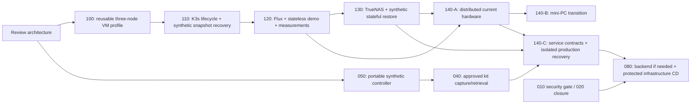

# Canonical Reconstruction Roadmap

This replaces the previous backend-first/LXC-first sequence. It is not an
appendix to that sequence. [Architecture](architecture.md) is the target;
[tasks](../tasks/README.md) own acceptance. The dated
[audit roadmap](audits/2026-09-24/milestone-roadmap.md) is historical evidence,
not a competing active plan. Task 100's repository-only phase is now authorized;
live allocation, planning, deployment and convergence remain separate gates.

## Starting evidence and boundaries

- Quality CI is functional: run139/01ccefb reported, run24/8c12871 and
  run25/c636d1f observed successful. Task010 and formal020 security gates remain
  open; no untrusted PR or production deployment credentials on shared CT301.
- Task030 contract accepted; Task040 preparation/synthetic checks exist, no kit
  produced/recovered. Six current local states retain their authorities.
- Task035 headless capability passed CI, but VM603/.32 not allocated, no plan/
  creation/start/convergence. Preserve its preflight; make VM an optional050 test.
- No Kubernetes/Flux/storage integration is implemented. Current running services
  and personal/technical data remain untouched.

## Critical path and parallel work

100/110/120 do NOT wait for a full production kit or a Consul comparison.
050 synthetic tooling and040 metadata/custody decisions can proceed independently
in separately assigned tasks. No simultaneous writes to shared Terraform roots.
A remains disposable and contains no irreplaceable production data. Production
migration cannot bypass service-specific independently verified recovery.
C hardware procurement is not a prerequisite for development, B or qualification
of a service that fits B; production placement still needs explicit approval.

## Milestone contracts

Each row includes deliverable, dependency, scope/exclusions, tests, approval and
recovery boundary. PLANNED/READY is never a live authorization.

| Task / deliverable | Depends on | Scope and exclusions | Observable acceptance/tests | Approval, rollback and exact next action |
| --- | --- | --- | --- | --- |
| 010/020 security foundation | Existing evidence | Finish effective source/socket/LAN/token trust; preserve useful quality checks. No privileged CD or weakening acceptance | Authenticated source inventory, denied untrusted execution and accepted/remediated residual risks; exact SHA quality result | Any runner/ACL change separately approved; rollback reviewed runner config. Next: retain secretless CI while new checks are added |
| 100 reusable A VM profile | Architecture/code-scope approval | Small reusable headless component; three new server VMs in independent root, environment map. No existing root/state move, GPU/USB/host changes or K3s | Mock three unique identities/local disks/no hooks; invalid duplicate inputs; workstation baseline unchanged; all-root readonly/backend-disabled validation | First code-only, then allocation+plan, exact saved apply, start/OS separate gates. No automatic cleanup. Next: assign110 after guest baseline accepted |
| 110 K3s bootstrap/lifecycle | 100 code and separately approved guests | Pinned server role, embedded etcd, explicit networking/API endpoint, synthetic snapshot/token recovery. No production secrets, Flux apps or unapproved drain | Three Ready servers/healthy members; second convergence no unintended changes; one-member failure, rejoin/upgrade, isolated snapshot restore; two failures lose quorum as expected | Approve install/network/test-token handling and each failure drill. Snapshot before change, never blind etcd downgrade/clone. Next:120 |
| 120 Flux/stateless/measurement | 110 accepted cluster; source boundary approved | Self-hosted GitOps; pinned public disposable app; bounded observability, outside probe strategy. No production DB or host socket | Reviewed source reconciles; negative RBAC; revert app; source outage/recovery; replica rescheduling; 24-hour resource/headroom evidence with workstations off | Approve Flux write/read identity hand-off and test ingress only. Suspend source/revert reviewed commit; no data to lose. Next:130 and140 capacity preflight |
| 050 portable controller | Accepted authority rules; independent code | Mac ARM64/Linux AMD64 verified tools, synthetic inputs and read-only doctor. No complete kit/VM prerequisite; no live provider operation | Fresh HOME/cache, blocked internal endpoints, exact SHA/tools, static checks and absent/wrong authority rejection | Clean-machine execution separately authorized; no real keys required for synthetic tests. Next:040 custody/capture gates |
| 040 production kit | 050 synthetic path; complete targeted inventory/custody;030 | Evolve manifest inventory; approved technical capture and independent encrypted retrieval. No bulk personal bytes or service promotion | Known required bytes independently available; writer freeze; correct/wrong key, corruption/missing/root mismatch; external/offline retrieval; no second writer | Exact exports/unsynced staging/key use/upload/decryption approvals separate. Keep previous verified generation. Next:140 service DR contracts |
| 130 TrueNAS and synthetic state | 110/120; verified TrueNAS version/access | NFS files, block/CSI/fencing and DB restore with throwaway data. No production default class/data/backup schedule edits | File/ACL and DB consistency; disconnect/reconnect; single-writer reattach; Retain behavior; restore on isolated target with hashes/transactions | Approve dedicated dataset/volumes/scoped credential and outage test, never whole NAS shutdown. Delete only reviewed disposable objects. Next:140-A or per-service contract |
| 140-A Stage B distributed | 120 measurements +130 failure behavior | One server each core/compute/lab, capacity/maintenance plan; no critical-service disruption | One physical-domain loss, API endpoint failover, quorum and workload headroom; approved node-by-node replacement/rebuild | New allocations, host impact, member transition individually approved. Preserve snapshots/token, stop if quorum unsafe. Next:140-B when hardware exists;140-C when service-ready |
| 140-B Stage C permanent | A/B evidence; actual mini-PCs | Choose Proxmox/VM vs bare metal from measured 8-GB budget; environment profile, later16-GB upgrade. No 32-GB requirement | Under measured load, host reserve, service performance, one-member loss/maintenance and independent restore | Hardware install and member migration approvals; no automatic node variable apply. Roll back by healthy-member procedure, not simultaneous clones. Next:continue service-specific cutovers |
| 140-C service reconstruction/DR | Per-service placement/storage+backup qualified;040/050 for production | One service at a time per architecture matrix; no wholesale translation or destructive legacy cleanup | Isolated restore, health/auth/permissions/data checks, single-writer switch, measured recovery, tested rollback/new-write handling; independent whole-cluster rebuild before production dependency | Each export/restore/cutover separately approved; retain old resources/read-only backup until acceptance. Next:next scoped service or080 |
| 080 state/CD decision | Need for multiple infrastructure writers;010/020 closure;040/050 and production DR | Requirements-led backend choice then isolated final-endpoint qualification; no mandatory Consul. Separate canary and protected CD tasks | TLS negatives, true two-client lock/crash/isolation/restore; freeze+single authority; exact-plan approval; denied ordinary-CI access | Backend security, state migration and apply each explicit. Bootstrap authority remains outside backend. Next:review first narrow privileged workflow, never blanket automation |

RPO/RTO, retention and acceptable service latency remain decisions until measured.
Stage B/C node relocation is not a Terraform profile-only migration. App rollback
must account for post-cutover writes and schema compatibility.

## Reconciled previous work

| Existing task | Current disposition / successor |
| --- | --- |
| 000 | DONE historical governance integration; its initial execution order no longer current |
| 010 / 020 | Keep unresolved security criteria and successful functional CI evidence |
| 030 | DONE accepted authority/custody contract; target recovery annex updates scope, not past proof |
| 035 | DEFERRED optional portable-controller VM adapter; tested code retained, uncommitted preflight preserved; no allocation approved |
| 040 | ADAPTED production kit track; not a blocker to disposable cluster learning |
| 050 | ADAPTED portable synthetic controller first, parallel with100; no full040 dependency cycle |
| 060 | DEFERRED conditional PG qualification under080; existing service and evidence retained |
| 070 | DEFERRED optional Consul only if requirements justify; no mandatory deployment/comparison |
| 080 | REPLACED sequence with requirements-led backend and protected-CD gates after recovery/security |
| 090 | SUPERSEDED as prerequisite by100; no generic LXC extraction without real need; active CT code/state untouched |

## Exact first implementation after approval

Assigned [Task100](../tasks/100-stage-a-headless-vms.md), **repository-only phase**:
the new root/module, baseline and mocked safety tests are implemented, without
selecting live allocations or changing existing resource addresses. Initial
sizing is three 4-GiB VMs; pve-lab is dedicated and workstations remain off.
Repository-only phase passed Forgejo run 27 at `ce61e86`; GitHub matched the
full implementation SHA. Task 100 records the completed read-only preflight and
operator approval of VMIDs303-305, k3s-server-1/2/3, .33-.35 outside Fizz DHCP.
The discarded701-703 proposal remains historical only. Ignored approved inputs
and inventory-based management mapping are ready; plan is explicitly authorized
but awaits the authenticated operator shell. No real plan/state/guests created.
Portable [050](../tasks/050-independent-controller.md) may
be assigned separately in parallel; it is not implemented automatically.

Execute the already-authorized new-resource-only plan through the existing
Infisical interface, then review the saved plan. Apply, start and OS convergence
remain subsequent approvals. Task035's previous candidate is not approval for
any server VM or for a standalone recovery VM.

## Evidence and delivery discipline

Read task/code/current state; implement one coherent deliverable; update tests
with code and affected docs; run checks; inspect staged diff; commit Conventionally;
push only with explicit authorization after checking workflow side effects;
observe exact SHA CI and independent GitHub copy; record limits and stop at
the next live gate. A green CI result is neither deployment nor recovery proof.
Historical audits remain immutable. Task statuses do not confer permissions.
