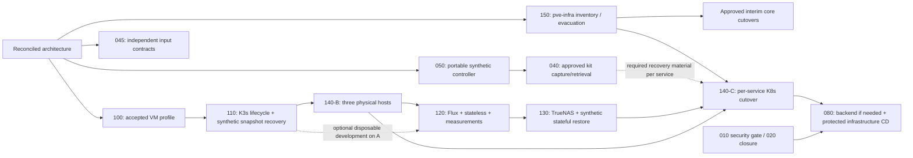

# Canonical Homelab Roadmap

Reconciled 2026-09-27 with the operator's experimental project direction and
physical target. This replaces the previous backend-first/LXC-first sequence. It is not an
appendix to that sequence. [Architecture](architecture.md) is the target;
[tasks](../tasks/README.md) own acceptance. The dated
[audit roadmap](audits/2026-09-24/milestone-roadmap.md) is historical evidence,
not a competing active plan. Task100's authorized guest baseline is live verified;
Task110 and any further infrastructure actions remain separate approval gates.

## Starting evidence and boundaries

- Quality CI is functional: run139/01ccefb reported, run24/8c12871 and
  run25/c636d1f observed successful. Task010 and formal020 security gates remain
  open; no untrusted PR or production deployment credentials on shared CT301.
- Task030 contract accepted; Task040 preparation/synthetic checks exist, no kit
  produced/recovered. Seven current local states retain their authorities; the
  new Stage A root requires Task040 manifest/schema follow-up before capture.
  Kit/storage-protection scope is now explicitly reconciled in the recovery
  contract; operator custody implementation is not a disposable-lab prerequisite.
- Task035 headless capability passed CI, but VM603/.32 not allocated, no plan/
  creation/start/convergence. Preserve its preflight; make VM an optional050 test.
- Stage A K3s is installed; system-pod permission failures block qualification.
  Flux/storage integration is not implemented. Existing production services and
  personal/technical data remain untouched.

## Critical path and parallel work

```mermaid
flowchart LR
  R[Reconciled architecture] --> V[100: accepted VM profile]
  R --> E[045: independent input contracts]
  V --> K[110: K3s lifecycle + synthetic snapshot recovery]
  K --> C[140-B: three physical hosts]
  C --> G[120: Flux + stateless + measurements]
  K -. optional disposable development on A .-> G
  G --> S[130: TrueNAS + synthetic stateful restore]
  R --> I[150: pve-infra inventory / evacuation]
  I --> M[Approved interim core cutovers]
  I --> D[140-C: per-service K8s cutover]
  R --> P[050: portable synthetic controller]
  P --> Q[040: approved kit capture/retrieval]
  Q -. required recovery material per service .-> D
  S --> D
  C --> D
  D --> F[080: backend if needed + protected infrastructure CD]
  T[010 security gate / 020 closure] --> F
```

100/110/120 do NOT wait for a full production kit or a Consul comparison.
050 synthetic tooling and040 metadata/custody decisions can proceed independently
in separately assigned tasks. No simultaneous writes to shared Terraform roots.
A remains disposable and contains no irreplaceable production data. Production
migration cannot bypass service-specific independently verified recovery.
C hardware is not a prerequisite for disposable120 development on accepted A.
Preferred rollout is110 ->140-B physical qualification ->120 ->130 ->140-C.
140-B does not require completed130 or a full app fleet;120 supplies later
representative load measurements before real-workload acceptance. Optional140-A
core/compute/lab transition is off the critical path. Independent150 inventory
and approved interim pve-core moves need not wait for Kubernetes or a full kit;
each move still requires its own backup/restore, capacity and cutover approval.

## Milestone contracts

Each row includes deliverable, dependency, scope/exclusions, tests, approval and
recovery boundary. PLANNED/READY is never a live authorization.

| Task / deliverable | Depends on | Scope and exclusions | Observable acceptance/tests | Approval, rollback and exact next action |
| --- | --- | --- | --- | --- |
| 010/020 security foundation | Existing evidence | Finish effective source/socket/LAN/token trust; preserve useful quality checks. No privileged CD or weakening acceptance | Authenticated source inventory, denied untrusted execution and accepted/remediated residual risks; exact SHA quality result | Any runner/ACL change separately approved; rollback reviewed runner config. Next: retain secretless CI while new checks are added |
| 100 reusable A VM profile | Architecture/code-scope approval | Small reusable headless component; three new server VMs in independent root, environment map. No existing root/state move, GPU/USB/host changes or K3s | Mock three unique identities/local disks/no hooks; invalid duplicate inputs; workstation baseline unchanged; all-root readonly/backend-disabled validation | First code-only, then allocation+plan, exact saved apply, start/OS separate gates. No automatic cleanup. Next: assign110 after guest baseline accepted |
| 110 K3s bootstrap/lifecycle | 100 code and separately approved guests | Pinned server role, embedded etcd, explicit networking/API endpoint, synthetic snapshot/token recovery. No production secrets, Flux apps or unapproved drain | Three Ready servers/healthy members; second convergence no unintended changes; one-member failure, rejoin/upgrade, isolated snapshot restore; two failures lose quorum as expected | Approve install/network/test-token handling and each failure drill. Snapshot before change, never blind etcd downgrade/clone. Next:140-B; optional disposable120 on accepted A |
| 120 Flux/stateless/measurement | 110 accepted cluster; source boundary approved | Self-hosted GitOps; pinned public disposable app; bounded observability, outside probe strategy. No production DB or host socket | Reviewed source reconciles; negative RBAC; revert app; source outage/recovery; replica rescheduling; 24-hour resource/headroom evidence with workstations off | Approve Flux write/read identity hand-off and test ingress only. Suspend source/revert reviewed commit; no data to lose. Next:130 and140 capacity preflight |
| 050 portable controller | Accepted authority rules; independent code | Mac ARM64/Linux AMD64 verified tools, synthetic inputs and read-only doctor. No complete kit/VM prerequisite; no live provider operation | Fresh HOME/cache, blocked internal endpoints, exact SHA/tools, static checks and absent/wrong authority rejection | Clean-machine execution separately authorized; no real keys required for synthetic tests. Next:040 custody/capture gates |
| 040 Recovery Kit | 050 synthetic path;030 reconciled; targeted inputs/data catalogue | Usable protected kit + restore instructions; operator owns external storage protection. No forced age/Apple workflow or bulk-data archive | Complete selected inventory, writer freeze, integrity/missing/root rejection and independent fresh-controller retrieval; referenced backups actually recoverable | Sensitive capture/use separately approved. Existing encryption-specific tests apply when that format is chosen; no second writer. Next: service-specific restore |
| 130 TrueNAS and synthetic state | 110/120; verified TrueNAS version/access | NFS files, block/CSI/fencing and DB restore with throwaway data. No production default class/data/backup schedule edits | File/ACL and DB consistency; disconnect/reconnect; single-writer reattach; Retain behavior; restore on isolated target with hashes/transactions | Approve dedicated dataset/volumes/scoped credential and outage test, never whole NAS shutdown. Delete only reviewed disposable objects. Next:140-C per-service contract |
| 140-A optional Stage B | Separate need/approval only | Historical core/compute/lab proposal, not mandatory | No new claim of qualification | Preserve ID/evidence; skip without blocking physical target |
| 140-B Stage C physical target | Accepted110, actual hardware/capacity/trust; not130/full040 | Proxmox VM on k8s-01/k8s-02/core; all voting; mini-PC preferred workloads, core fallback | Three physical domains, API failover, local etcd, node maintenance;120/130 later add measured workload/storage behavior | New allocations/plans/member changes separately approved; preserve core reservations. Next120, then130; no mandatory RAM upgrade |
| 140-C per-service migration | That service's target, storage, independent data recovery and capacity qualified | Suitable Proxmox services only; TrueNAS apps stay. Reuse040/050 material as needed, not blanket full-program gate | Isolated restore, auth/data/function checks, single-writer cutover, rollback handling new writes; measured limits | Each cutover approved; retain old resources until accepted. Interim core path via150 is independent of K8s |
| 045 independent deployment inputs | Reconciled architecture + inspected metadata | One thin explicit source selector feeding existing contracts, first one stack; no universal framework | Private and Infisical sources produce same non-secret inputs; no fallback, missing-input/secret-leak tests | Code-only first, no implied deployment or secret export; start with Stage A contract gaps |
| 150 pve-infra evacuation | Separately authorized live identity/inventory | High-priority parallel track: real node identity/quorum/guests/storage/dependencies/backups; K8s vs interim/permanent core placement | Per-service capacity, recovery, cutover/rollback and infrastructure removal-impact review | No assumed equivalence to compute, no blanket migration/decommission; can advance before120/130 |
| 080 state/CD decision | Need for multiple infrastructure writers;010/020 closure;040/050 and production DR | Requirements-led backend choice then isolated final-endpoint qualification; no mandatory Consul. Separate canary and protected CD tasks | TLS negatives, true two-client lock/crash/isolation/restore; freeze+single authority; exact-plan approval; denied ordinary-CI access | Backend security, state migration and apply each explicit. Bootstrap authority remains outside backend. Next:review first narrow privileged workflow, never blanket automation |

RPO/RTO, retention and acceptable service latency remain decisions until measured.
Stage B/C node relocation is not a Terraform profile-only migration. App rollback
must account for post-cutover writes and schema compatibility.

## Reconciled previous work

| Existing task | Current disposition / successor |
| --- | --- |
| 000 | DONE historical governance integration; its initial execution order no longer current |
| 010 / 020 | Keep unresolved security criteria and successful functional CI evidence |
| 030 | DONE accepted authority/custody contract; target recovery annex updates scope, not past proof |
| 035 | DEFERRED optional portable-controller VM adapter; tested code retained, uncommitted preflight preserved; no allocation approved |
| 040 | ADAPTED production kit track; not a blocker to disposable cluster learning |
| 050 | ADAPTED portable synthetic controller first, parallel with100; no full040 dependency cycle |
| 060 | DEFERRED conditional PG qualification under080; existing service and evidence retained |
| 070 | DEFERRED optional Consul only if requirements justify; no mandatory deployment/comparison |
| 080 | REPLACED sequence with requirements-led backend and protected-CD gates after recovery/security |
| 090 | SUPERSEDED as prerequisite by100; no generic LXC extraction without real need; active CT code/state untouched |

## Current handoff

Assigned [Task100](../tasks/100-stage-a-headless-vms.md): technical live acceptance
satisfied and accepted by the operator on 2026-09-26; Task100 is DONE. Approved VMs303-305,
k3s-server-1/2/3 at .33-.35, each 2 vCPU/4 GiB/32 GiB, are running on pve-lab.
Operator applied four additions and started guests; explicit TOFU enrollment,
strict subsequent SSH, baseline and second zero-change convergence succeeded.
Task100 holds actual evidence and the cloud-init deprecation warning. Existing
resources/states remain unchanged; the new Stage A state is authority seven.
Portable [050](../tasks/050-independent-controller.md) may
be assigned separately in parallel; it is not implemented automatically.

Task110 is installed with operator-reported zero-change second convergence.
The preceding approved unit-only maintenance set all K3s/containerd umasks0022;
actual etcd stayed healthy. CoreDNS/metrics-server now fail reading projected
service-account tokens. Record this evidence in110; no further repair authorized
by this architecture assignment. Broader input-source direction is now approved,
but adapter implementation remains045, not a side effect of documentation.
Lifecycle drills still need separate approval and evidence before110 DONE or120.
Task035 remains separately unallocated.

## Evidence and delivery discipline

Read task/code/current state; implement one coherent deliverable; update tests
with code and affected docs; run checks; inspect staged diff; commit Conventionally;
push only with explicit authorization after checking workflow side effects;
observe exact SHA CI and independent GitHub copy; record limits and stop at
the next live gate. A green CI result is neither deployment nor recovery proof.
Historical audits remain immutable. Task statuses do not confer permissions.
