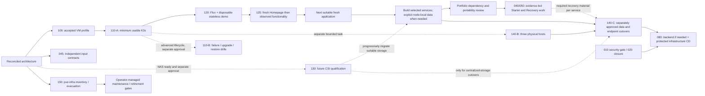

# Canonical Homelab Roadmap

Reconciled 2026-09-27 with the operator's experimental project direction and
physical target. This replaces the previous backend-first/LXC-first sequence. It is not an
appendix to that sequence. [Architecture](architecture.md) is the target;
[tasks](../tasks/README.md) own acceptance. The dated
[audit roadmap](audits/2026-09-24/milestone-roadmap.md) is historical evidence,
not a competing active plan. Task100's authorized guest baseline is live verified;
Task110 and any further infrastructure actions remain separate approval gates.

## Starting evidence and boundaries

- Quality CI is functional: run139/01ccefb reported, run24/8c12871 and
  run25/c636d1f observed successful. Task010 and formal020 security gates remain
  open; no untrusted PR or production deployment credentials on shared CT301.
- Task030 contract accepted; Task040 preparation/synthetic checks exist, no kit
  produced/recovered. Seven current local states retain their authorities; the
  new Stage A root requires Task040 manifest/schema follow-up before capture.
  Kit/storage-protection scope is now explicitly reconciled in the recovery
  contract; operator custody implementation is not a disposable-lab prerequisite.
- Task035 headless capability passed CI, but VM603/.32 not allocated, no plan/
  creation/start/convergence. Preserve its preflight; make VM an optional050 test.
- Stage A K3s minimum foundation is accepted after targeted system-pod repair.
  Flux/controllers/source/demo and one Git-driven change are live verified under
  Task120; broader exercises remain open. Storage is unimplemented; real data untouched.

## Critical path and parallel work

```mermaid
flowchart LR
  R[Reconciled architecture] --> V[100: accepted VM profile]
  R --> E[045: independent input contracts]
  V --> K[110-A: minimum usable K3s]
  K --> G[120: Flux + disposable stateless demo]
  G --> H[125: fresh Homepage then observed functionality]
  H --> N[Next suitable fresh application]
  N --> W[Build selected services; explicit node-local data when needed]
  R -. NAS ready and separate approval .-> S[130: future CSI qualification]
  S -. progressively migrate suitable storage .-> W
  W --> P[Portfolio dependency and portability review]
  P --> Q[040/050: evidence-led Starter and Recovery work]
  K -. separate bounded task .-> C[140-B: three physical hosts]
  K -. advanced lifecycle, separate approval .-> L[110-B: failure / upgrade / restore drills]
  R --> I[150: pve-infra inventory / evacuation]
  I --> M[Operator-managed maintenance / retirement gates]
  Q -. required recovery material per service .-> D
  S -. only for centralized-storage cutovers .-> D
  W --> D[140-C: separately approved data and endpoint cutovers]
  C --> D
  D --> F[080: backend if needed + protected infrastructure CD]
  T[010 security gate / 020 closure] --> F
```

The critical path is concentric: finish110-A, demonstrate120, build fresh125,
observe actual needed functionality, then add one suitable application at a time.
Use explicit node-local storage for initial stateful workloads where appropriate;
the owning node is a deliberate availability dependency, not failover storage.
Task130 waits for NAS readiness and separate qualification, not the first PVC.
No TrueNAS CSI, Longhorn, full Recovery Kit, remote Terraform backend or
protected infrastructure CD prerequisite for fresh application development.

140-B may proceed as a separately bounded task after110-A and verified host
prerequisites; it must not block Stage A Flux/Homepage work. The approved physical
target remains pve-k8s-01, pve-k8s-02 and pve-core. Advanced110-B drills remain
unverified planned work, not a disposable-app gate. Real data still needs its own
qualified recovery and cutover. No simultaneous writes to shared Terraform roots.

045 is implemented; preserve its Stage A selector, without generalizing adapters.
150's initial inventory is complete; ordinary CT transfers are operator-managed
maintenance outside this development path. DNS, Tailscale and quorum retirement
gates remain. Once the actual application portfolio exists, review its complete
dependency graph and improve portability, Starter/Recovery and operations from
observed needs.040/050, additional adapters and broader recovery remain separately
assigned follow-ups; their existing protections and evidence are retained.

## Application development pattern

1. Read maintained upstream documentation for the selected service.
2. Deploy a fresh instance through Flux with version-controlled manifests or a
   suitable maintained chart; verify that it works before examining the old service.
3. Inspect the corresponding existing service read-only under explicit approval.
4. Identify used features, configuration and dependencies, then adapt the fresh
   declarative implementation. Do not copy the old CT filesystem or live data.
5. Validate the result before selecting the next service. Preserve historical
   details only where required for desired functionality.

Homepage is the first real app after the disposable demo. Final data migration,
DNS cutover and retirement are separate operations after the replacement works;
fresh development does not grant permission to change existing services.
Follow the [initial storage contract](architecture.md#initial-development-storage):
keep stateless/config-only apps portable and volume-free where possible; pin local
stateful workloads to their data owner. No automatic local-path enablement.

## Milestone contracts

Each row includes deliverable, dependency, scope/exclusions, tests, approval and
recovery boundary. PLANNED/READY is never a live authorization.

| Task / deliverable | Depends on | Scope and exclusions | Observable acceptance/tests | Approval, rollback and exact next action |
| --- | --- | --- | --- | --- |
| 010/020 security foundation | Existing evidence | Finish effective source/socket/LAN/token trust; preserve useful quality checks. No privileged CD or weakening acceptance | Authenticated source inventory, denied untrusted execution and accepted/remediated residual risks; exact SHA quality result | Any runner/ACL change separately approved; rollback reviewed runner config. Next: retain secretless CI while new checks are added |
| 100 reusable A VM profile | Architecture/code-scope approval | Small reusable headless component; three new server VMs in independent root, environment map. No existing root/state move, GPU/USB/host changes or K3s | Mock three unique identities/local disks/no hooks; invalid duplicate inputs; workstation baseline unchanged; all-root readonly/backend-disabled validation | First code-only, then allocation+plan, exact saved apply, start/OS separate gates. No automatic cleanup. Next: assign110 after guest baseline accepted |
| 110 K3s bootstrap/lifecycle | 100 accepted guests | A: usable development foundation. B: advanced lifecycle, separate approval. No Flux/apps or unapproved repair | A: three Ready nodes, actual healthy etcd, healthy CoreDNS/metrics-server, pod networking/service DNS/API, repeatable Ansible. B: member loss/rejoin, upgrades and isolated snapshot restore remain unverified | Next single scope: incident diagnosis/repair and A qualification; A acceptance releases120. Full110 DONE still requires B; no implicit restart/reset |
| 120 Flux/stateless demo | 110 acceptance A; source boundary approved | One reviewed Flux source and pinned disposable app on Stage A; no production data or host socket | Reconciliation, RBAC denial, Git revert, source outage/recovery, bounded pod rescheduling and basic headroom; no member-loss prerequisite | Approve bootstrap/identity and cluster writes separately. Next125; extended capacity measurements before real-workload physical acceptance |
| 125 fresh Homepage | 120 accepted demo | Fresh declarative app, then read-only CT201 feature discovery and adaptation; no old filesystem/data copy | Healthy fresh instance, used-feature comparison, scoped inputs, tested functions/revert and unchanged CT201 | Separate deployment and inspection approvals; next suitable app with explicit node-local storage if needed; cutover remains separate |
| 050 portable controller | Accepted authority rules; independent code | Mac ARM64/Linux AMD64 verified tools, synthetic inputs and read-only doctor. No complete kit/VM prerequisite; no live provider operation | Fresh HOME/cache, blocked internal endpoints, exact SHA/tools, static checks and absent/wrong authority rejection | Clean-machine execution separately authorized; no real keys required for synthetic tests. Next:040 custody/capture gates |
| 040 Recovery Kit | 050 synthetic path;030 reconciled; targeted inputs/data catalogue | Usable protected kit + restore instructions; operator owns external storage protection. No forced age/Apple workflow or bulk-data archive | Complete selected inventory, writer freeze, integrity/missing/root rejection and independent fresh-controller retrieval; referenced backups actually recoverable | Sensitive capture/use separately approved. Existing encryption-specific tests apply when that format is chosen; no second writer. Next: service-specific restore |
| 130 future TrueNAS and synthetic state | NAS ready;110-A/120; verified TrueNAS version/access and separate assignment | CSI qualification with throwaway data, then progressive suitable local-data migrations; not a fresh-app prerequisite | Workload-specific permissions, persistence, consistency, fencing and isolated restore; no production default class or data move | Approve dedicated volumes/credentials/tests; each data move has140-C gates. Initial apps use the node-local contract |
| 140-A optional Stage B | Separate need/approval only | Historical core/compute/lab proposal, not mandatory | No new claim of qualification | Preserve ID/evidence; skip without blocking physical target |
| 140-B Stage C physical target | Accepted110-A, actual hardware/capacity/trust; not130/full040 | Independent bounded physical task, not a120/125 prerequisite; three active voting VMs | Three physical domains, API failover, local etcd, node maintenance; later representative workload/storage evidence | New allocations/member changes separately approved; preserve core reservations and approved hardware target |
| 140-C per-service migration | That service's target, storage, independent data recovery and capacity qualified | Suitable Proxmox services only; TrueNAS apps stay. Reuse040/050 material as needed, not blanket full-program gate | Isolated restore, auth/data/function checks, single-writer cutover, rollback handling new writes; measured limits | Each cutover approved; retain old resources until accepted. Interim core path via150 is independent of K8s |
| 045 independent deployment inputs | Implemented Stage A selector | Preserve current private/Infisical adapter; other stacks out of current scope | Existing offline tests/evidence retained; no claim of live private-source qualification | No broad adapter expansion on app critical path |
| 150 pve-infra evacuation | Initial read-only inventory complete | Operator-managed maintenance; preserve DNS/Tailscale/quorum and per-service recovery gates | Existing assessment retained; transfers/retirement not performed | Separate authorization for any maintenance; not a CT-by-CT Kubernetes development roadmap |
| 080 state/CD decision | Need for multiple infrastructure writers;010/020 closure;040/050 and production DR | Requirements-led backend choice then isolated final-endpoint qualification; no mandatory Consul. Separate canary and protected CD tasks | TLS negatives, true two-client lock/crash/isolation/restore; freeze+single authority; exact-plan approval; denied ordinary-CI access | Backend security, state migration and apply each explicit. Bootstrap authority remains outside backend. Next:review first narrow privileged workflow, never blanket automation |

RPO/RTO, retention and acceptable service latency remain decisions until measured.
Stage B/C node relocation is not a Terraform profile-only migration. App rollback
must account for post-cutover writes and schema compatibility.

## Reconciled previous work

| Existing task | Current disposition / successor |
| --- | --- |
| 000 | DONE historical governance integration; its initial execution order no longer current |
| 010 / 020 | Keep unresolved security criteria and successful functional CI evidence |
| 030 | DONE accepted authority/custody contract; target recovery annex updates scope, not past proof |
| 035 | DEFERRED optional portable-controller VM adapter; tested code retained, uncommitted preflight preserved; no allocation approved |
| 040 | ADAPTED production kit track; not a blocker to disposable cluster learning |
| 050 | ADAPTED portable synthetic controller first, parallel with100; no full040 dependency cycle |
| 060 | DEFERRED conditional PG qualification under080; existing service and evidence retained |
| 070 | DEFERRED optional Consul only if requirements justify; no mandatory deployment/comparison |
| 080 | REPLACED sequence with requirements-led backend and protected-CD gates after recovery/security |
| 090 | SUPERSEDED as prerequisite by100; no generic LXC extraction without real need; active CT code/state untouched |

## Current handoff

Assigned [Task100](../tasks/100-stage-a-headless-vms.md): technical live acceptance
satisfied and accepted by the operator on 2026-09-26; Task100 is DONE. Approved VMs303-305,
k3s-server-1/2/3 at .33-.35, each 2 vCPU/4 GiB/32 GiB, are running on pve-lab.
Operator applied four additions and started guests; explicit TOFU enrollment,
strict subsequent SSH, baseline and second zero-change convergence succeeded.
Task100 holds actual evidence and the cloud-init deprecation warning. Existing
resources/states remain unchanged; the new Stage A state is authority seven.
Portable [050](../tasks/050-independent-controller.md) may
be assigned separately in parallel; it is not implemented automatically.

Task110-A is live verified and operator accepted: targeted replacement of the two
old system pods renewed their0077 shims; new shims0022, healthy DNS/metrics,
cross-node networking and actual etcd/API evidence are recorded in110. Earlier
zero-change Ansible convergence remains dated evidence, not a newly repeated run.
045 implements explicit Stage A private/Infisical delivery with offline
tests and an unchanged default public key. Other adapters remain separate work;
publication CI is checked at delivery, not proof of live provider authentication.
Lifecycle drills still need separate approval and evidence before110 DONE, but
not before120:110 acceptance A is now satisfied. Task120's approved disposable
milestone is live verified: restored strict SSH access, healthy Flux controllers,
anonymous Forgejo source, two healthy demo replicas and Git-driven revision2.
See [actual evidence](../tasks/120-gitops-stateless.md#live-disposable-milestone---2026-10-02).
Broader drift/revert/source-outage/rescheduling exercises remain open, not claimed
by the successful rollout. Next single task is125 fresh Homepage, not started here.
Task035 remains separately unallocated.

Task150 read-only assessment on2026-09-28 confirms infra/.10, CT200-204 and
host-level Tailscale LAN routing. See the [evacuation plan](pve-infra-evacuation.md).
Core is a plausible interim destination, not capacity-approved. Fresh201/203
backup coverage, isolated recovery, USB/tunnel/remote-access gates and operator
review remain for operator-managed maintenance, not the development critical path.
No migration or cluster removal authorized; Task150 remains IN_PROGRESS.

150-F now has a separately assigned [repository-only router pair](../tasks/150-f-tailscale-routers.md)
on pve-k8s-01/02. Two VMIDs/IPs and live route/failover acceptance remain pending;
this does not authorize retirement or change the concentric application path.

## Evidence and delivery discipline

Read task/code/current state; implement one coherent deliverable; update tests
with code and affected docs; run checks; inspect staged diff; commit Conventionally;
push only with explicit authorization after checking workflow side effects;
observe exact SHA CI and independent GitHub copy; record limits and stop at
the next live gate. A green CI result is neither deployment nor recovery proof.
Historical audits remain immutable. Task statuses do not confer permissions.
